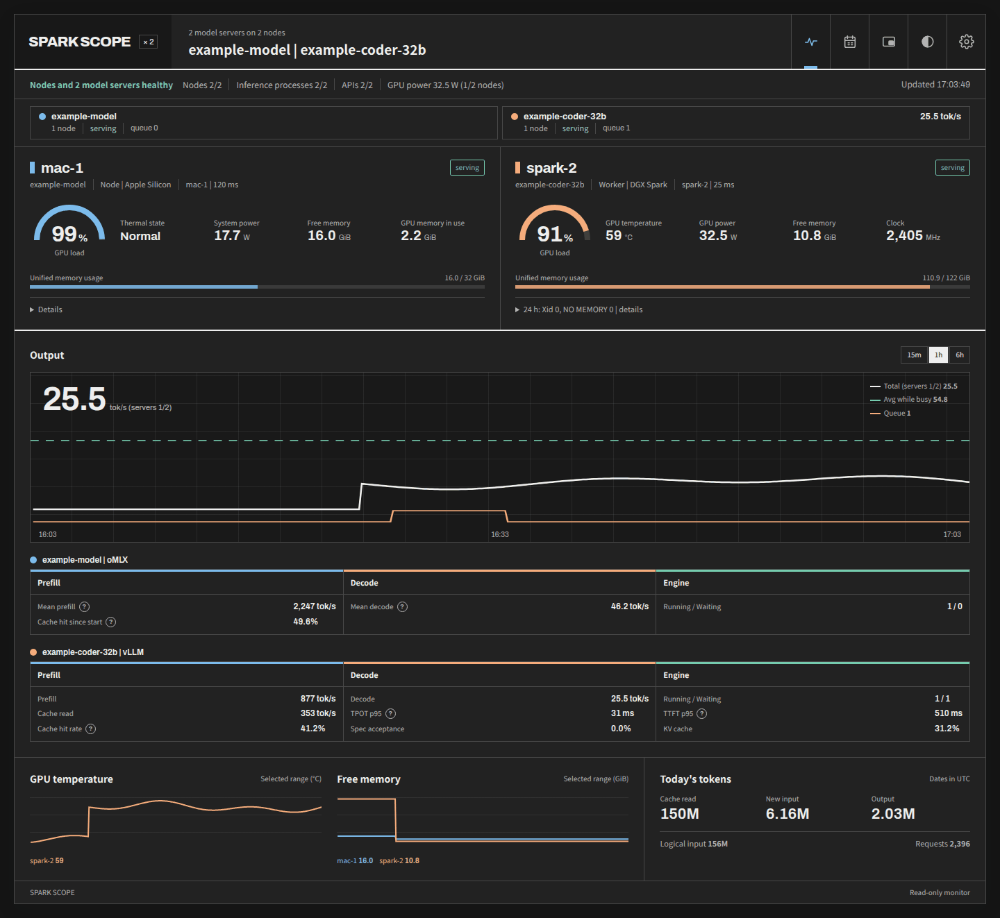
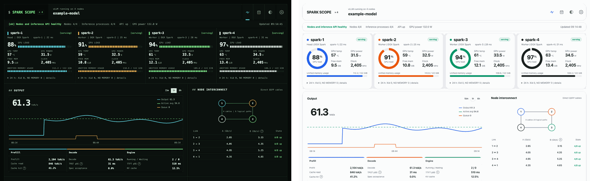

# Changelog

## 0.1.4 (2026-10-09)

### Added

- Apple Silicon Mac nodes, collected locally or over SSH with the built-in macOS tools and no sudo ([#45](https://github.com/juliankang4/spark-scope/pull/45)):
  - GPU load, shared system memory, swap and compressed memory, disk and the inference process;
  - thermal state, MacBook system power and GPU memory in use in the slots for GPU temperature, GPU power and clock;
  - memory warnings that follow the OS memory pressure level.
- oMLX, read from its status API ([#47](https://github.com/juliankang4/spark-scope/pull/47)):
  - running and waiting requests, cache hit since start, and mean prefill and decode speeds of completed requests;
  - polling never loads a model or resets oMLX's idle timer.
- Optional engine API key, sent as a Bearer header on every engine read ([#47](https://github.com/juliankang4/spark-scope/pull/47)):
  - `SPARK_SCOPE_API_KEY` for a single server, or `apiKeyEnv` per server in `topology.json`, naming an environment variable that holds the key;
  - the key never reaches the pages or the logs. Nothing changes if your engine needs no key.
- llama.cpp, from `llama-server --metrics` ([#42](https://github.com/juliankang4/spark-scope/pull/42), [#46](https://github.com/juliankang4/spark-scope/pull/46)):
  - live output speed from `/slots` while requests run, cache hit rate, mean decode time and context used;
  - an idle server is never woken by polling.
- Strata, with TTFT and TPOT p95 from its histograms and context used ([#43](https://github.com/juliankang4/spark-scope/pull/43), [#46](https://github.com/juliankang4/spark-scope/pull/46)). A server that has unloaded its model reads as idle.
- GPU memory for machines with their own VRAM, such as a workstation next to the Sparks ([#41](https://github.com/juliankang4/spark-scope/pull/41)):
  - "GPU memory" on the node card and "VRAM" on the mini window and the rack panel;
  - `gpu.memory` in `/api/state`; `memory` stays system RAM;
  - `npm run demo -- --discrete` adds one to the made-up data.
- Calendar: a switch between Output, New input + output and Total tokens, remembered in the browser ([#38](https://github.com/juliankang4/spark-scope/pull/38)).
- Mini window in Safari and on phones: the page itself switches to the mini view, and a phone opens in it ([#35](https://github.com/juliankang4/spark-scope/pull/35)):
  - a back arrow returns to the full dashboard;
  - in a window at least 720 px tall, Glance, Scope and Runs stack instead of sitting behind tabs;
  - the separate popup window for other browsers is gone; `/mini/` still works.
- README: a prompt for installing with a coding agent, and the [dsh-spark-scope](https://github.com/juliankang4/dsh-spark-scope) plugin for the DeepSeek Harness sidebar.

### Changed

- The engine panel, the mini window and the rack panel hide the fields an engine never reports instead of showing `unknown` ([#46](https://github.com/juliankang4/spark-scope/pull/46)):
  - `/api/state` adds `reported` and `metricKinds` to each inference reading;
  - TensorFold 1.0 (native server) counts live and finished output for decode, and reads TPOT and prefill from its histograms;
  - vLLM and SGLang hide speculative acceptance while speculative decoding is off.
- Up to eight nodes and several model servers ([#44](https://github.com/juliankang4/spark-scope/pull/44)):
  - the node grid fills its rows without an empty cell;
  - the model servers share one strip under the status line;
  - the mini window lists each server with the total;
  - the rack panel shows bays for the first four nodes, and its band still counts every node.
- Clearer wording on the pages and the rack panel, in English and Korean ([#36](https://github.com/juliankang4/spark-scope/pull/36)), for example "Turn orange when", "Cache hit rate" and "3 kernel errors".
- `npm run check` holds the repository rules, and one "CI passed" check gates merges ([#39](https://github.com/juliankang4/spark-scope/pull/39)).

### Fixed

- A failed system service whose unit file was gone, such as the mount of a removed snap revision, kept the "failed system service" warning until a reboot ([#37](https://github.com/juliankang4/spark-scope/pull/37)).
- On engines without latency histograms, TTFT and TPOT changed to "no requests" after the second poll ([#46](https://github.com/juliankang4/spark-scope/pull/46)).
- The mini window's GPU power chip read 0 W when no node reported power ([#45](https://github.com/juliankang4/spark-scope/pull/45)).
- `npm run demo -- --mode fault` failed with 7 or 8 nodes ([#44](https://github.com/juliankang4/spark-scope/pull/44)).

## 0.1.3 (2026-10-03)

### Added

- Model servers: nodes that serve in separate groups (two nodes used one by one, four as 2 + 2, three as 2 + 1) are listed under `servers` in `topology.json`, each with its own API ([#32](https://github.com/juliankang4/spark-scope/pull/32), [#33](https://github.com/juliankang4/spark-scope/pull/33)):
  - a row per server above the chart, and its server on each node card;
  - All at once (a line and an engine panel per server, the total on top) or One at a time, in the settings;
  - a chip per server on the rack panel's band, `?server=` to follow one;
  - one token ledger for every server;
  - `npm run demo -- --servers 2` shows them on made-up data.
- Keyboard shortcuts: `S` Scope, `L` token ledger, `M` mini window, `,` settings, `?` the list of them ([#33](https://github.com/juliankang4/spark-scope/pull/33)).

### Fixed

- The mini window's `M` did nothing while a Korean keyboard layout was on ([#33](https://github.com/juliankang4/spark-scope/pull/33)).

## 0.1.2 (2026-10-03)

### Added

- TensorFold alongside vLLM and SGLang: its metrics, and on CUDA the `/health` counters for live output speed, cache hit rate and prefill rates ([#29](https://github.com/juliankang4/spark-scope/pull/29)).

### Changed

- `SPARK_SCOPE_API_URL` must be an `http://` or `https://` URL without a user name or password; otherwise the server stops with a message ([#30](https://github.com/juliankang4/spark-scope/pull/30)).

### Fixed

Fixed in [#30](https://github.com/juliankang4/spark-scope/pull/30):

- Settings: the Readings dropdowns were pushed to the right in a narrow dialog, and on a short screen below 1050 px the choices slid behind the preview.
- Kernel errors from before a reboot were not counted, and a journal the account cannot read showed 0 errors instead of "unavailable".
- Token ledger:
  - a clock that went back booked a restarted run again on every poll;
  - the page could open on the viewer's month instead of the server's and did not follow the month change;
  - the input chart was empty when the engine does not split cache read and new input.
- Rack panel:
  - the band jumped back and forth and drew dips that never happened;
  - the footer cut the power reading short;
  - the low-memory reason ignored `mem=gb`.
- Web page:
  - the trend legends kept old values while the server was down;
  - a custom node colour did not update its row until the focus moved;
  - dragging a selection out of the settings closed them.

## 0.1.1 (2026-10-03)

### Added

- Settings dialog, from the gear button in the header ([#14](https://github.com/juliankang4/spark-scope/pull/14), [#18](https://github.com/juliankang4/spark-scope/pull/18), [#19](https://github.com/juliankang4/spark-scope/pull/19), [#21](https://github.com/juliankang4/spark-scope/pull/21)):
  - node card: the four readings and their order, the bars, full or short labels, the levels that turn a reading orange;
  - a colour per node, from the palette or custom;
  - units: °C or °F, GiB or GB, 24- or 12-hour clock;
  - dashboard: panels to show, chart range, refresh interval, pausing hidden tabs, theme;
  - rack panel: band motion and the kiosk URL;
  - a settings link that carries them to another browser.
- Designs: Default, Console and Soft ([#23](https://github.com/juliankang4/spark-scope/pull/23)).
- Korean for the web page and the rack panel (`?lang=ko`) ([#16](https://github.com/juliankang4/spark-scope/pull/16)).
- Mini window (`M`): glance, scope and recorded runs, kept on top in Chrome and Edge ([#24](https://github.com/juliankang4/spark-scope/pull/24)).
- Token ledger: statement, calendar and charts, a table by model, CSV export ([#26](https://github.com/juliankang4/spark-scope/pull/26)).
- `?` explanations next to the figures that need one ([#17](https://github.com/juliankang4/spark-scope/pull/17)).
- Rack panel options in its address: `temp=f`, `mem=gb`, `colors=`, `motion=` ([#21](https://github.com/juliankang4/spark-scope/pull/21)).
- `npm run demo`: the pages on made-up data, without a Spark ([#25](https://github.com/juliankang4/spark-scope/pull/25)).
- API: `/api/state` adds `version`, `messageKey` and `messageParams`, the 5-minute latency fields, `prefillUpdatedAt` and `rackSeenAt`; `/api/usage` adds each day's and the month's models and `firstDay` ([#15](https://github.com/juliankang4/spark-scope/pull/15), [#16](https://github.com/juliankang4/spark-scope/pull/16), [#21](https://github.com/juliankang4/spark-scope/pull/21), [#24](https://github.com/juliankang4/spark-scope/pull/24), [#26](https://github.com/juliankang4/spark-scope/pull/26)).

### Changed

- TTFT and TPOT p95 cover the last 5 minutes; the value since the engine started is behind the `?` ([#15](https://github.com/juliankang4/spark-scope/pull/15)).
- A hidden web tab pauses its updates and catches up when shown ([#13](https://github.com/juliankang4/spark-scope/pull/13)).
- The rack kiosk uses about a third of the CPU: the band moves in one-pixel steps and the kiosk turns off Chromium's renderer accessibility. Reinstall `kiosk/spark-scope-kiosk` to get the second part ([#13](https://github.com/juliankang4/spark-scope/pull/13)).
- A shorter README with a Korean version; the reference moved to `docs/` ([#11](https://github.com/juliankang4/spark-scope/pull/11), [#27](https://github.com/juliankang4/spark-scope/pull/27)).
- CI renders the pages and fails on clipped text, overflow or script errors ([#12](https://github.com/juliankang4/spark-scope/pull/12)). A shorter contributing guide; English is enough for a pull request ([#20](https://github.com/juliankang4/spark-scope/pull/20)).

### Fixed

- "GPU temperature" wrapped onto two lines on narrow cards and pushed the readings out of line ([#18](https://github.com/juliankang4/spark-scope/pull/18)).

## 0.1.0 (2026-10-02)

The first tagged release. Spark Scope went public on 2026-10-01; this covers everything changed since.

### Added

- CPU load, NVMe and ConnectX NIC temperatures, every ACPI thermal zone and the total GPU power, on the web page and the rack panel ([#3](https://github.com/juliankang4/spark-scope/pull/3)).
- A favicon and home-screen icon ([#5](https://github.com/juliankang4/spark-scope/pull/5)).
- Rack panel: a compact layout for five or more nodes and narrow screens, `?width` down to 800, a centred letterbox. Web page: state-coloured badges, a three-way theme button (system, light, dark), a Logical input column in the daily table, eight node colours ([#8](https://github.com/juliankang4/spark-scope/pull/8)).
- `SPARK_SCOPE_ALLOWED_HOSTS` and a Content-Security-Policy on every response ([#9](https://github.com/juliankang4/spark-scope/pull/9)).
- CI on x64 and arm64, contributing and security notes, issue templates ([#10](https://github.com/juliankang4/spark-scope/pull/10)).

### Changed

- `/api/state` calls the engine metrics `inference` (`vllm` is still sent as an alias and will be removed later). It no longer sends the engine URL, the local model path, interface names or raw SSH error text ([#9](https://github.com/juliankang4/spark-scope/pull/9)).
- Requests that name another site's host are refused ([#9](https://github.com/juliankang4/spark-scope/pull/9)). If you reach the dashboard under a name other than localhost, an IP address or the machine's own hostname, add it to `SPARK_SCOPE_ALLOWED_HOSTS`.
- Latency p95 is interpolated inside the histogram bucket, as Prometheus does ([#9](https://github.com/juliankang4/spark-scope/pull/9)).
- Token counts use three significant digits on both pages (`1.5K`, `9.55M`) ([#8](https://github.com/juliankang4/spark-scope/pull/8)).
- The pages poll without history every 2 seconds and fetch it every 30 seconds; responses are gzip-compressed; the rack band moves with a CSS transition instead of a frame loop ([#6](https://github.com/juliankang4/spark-scope/pull/6)).
- The topology is looked for in `~/.config/spark-scope/topology.json` first ([#4](https://github.com/juliankang4/spark-scope/pull/4)).
- The kiosk starts Chromium with `--class=spark-scope-kiosk` and the labwc rule matches only that window. Change an existing `identifier="chromium*"` rule to `spark-scope-kiosk` ([#10](https://github.com/juliankang4/spark-scope/pull/10)).

### Fixed

- iOS Safari scrolled the page on every poll ([#1](https://github.com/juliankang4/spark-scope/pull/1)).
- A hung `nvidia-smi` or `docker` emptied the node card and left processes behind. An SGLang restart could drop tokens from the ledger. Metrics an engine does not export were stored as 0. vLLM data-parallel engines were read as one. Interval settings such as `2s` were accepted ([#2](https://github.com/juliankang4/spark-scope/pull/2)).
- The kiosk hung for host names starting with "rack" and failed to start over SSH. The README quick start missed steps ([#4](https://github.com/juliankang4/spark-scope/pull/4)).
- Stale-data, drawing-error and ledger-month handling on the web page and the rack panel ([#6](https://github.com/juliankang4/spark-scope/pull/6)).
- SGLang's decode rate read 0 while requests ran and spiked when they finished ([#7](https://github.com/juliankang4/spark-scope/pull/7)).
- Long names, rounding at unit boundaries, contrast below AA and a node id `at` breaking the trend charts ([#8](https://github.com/juliankang4/spark-scope/pull/8)).
- Unread engine responses held connections open. A mistyped interface name read as a broken link ([#9](https://github.com/juliankang4/spark-scope/pull/9)).
