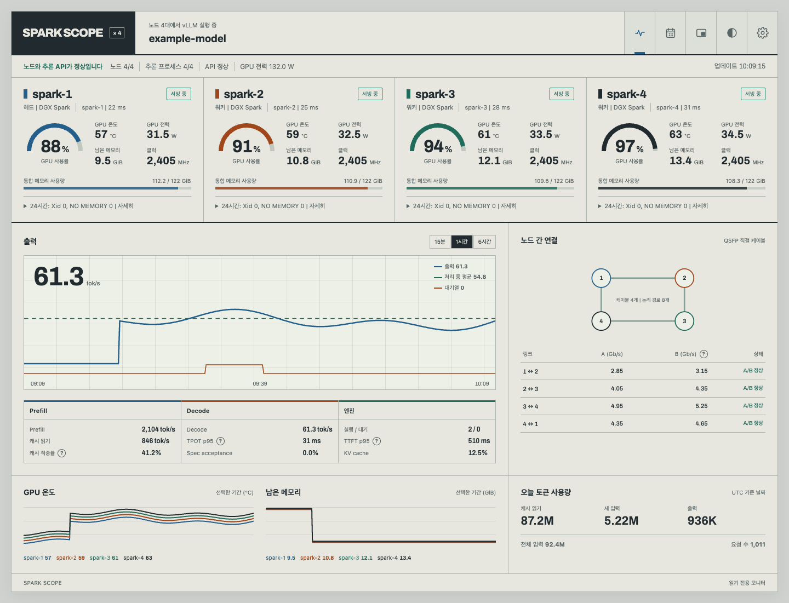
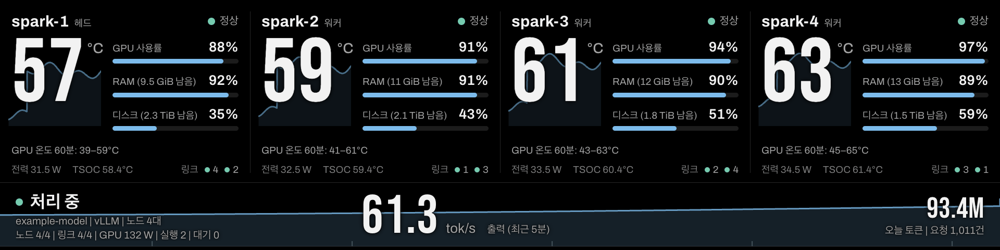
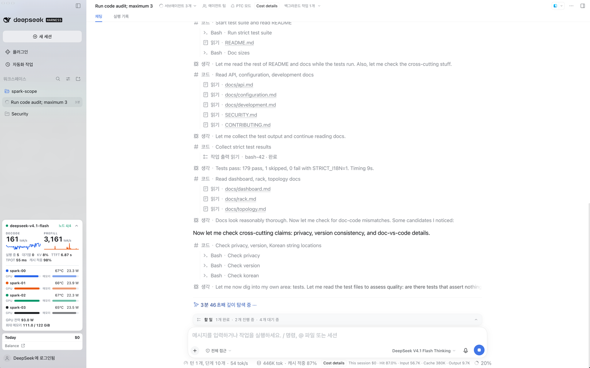
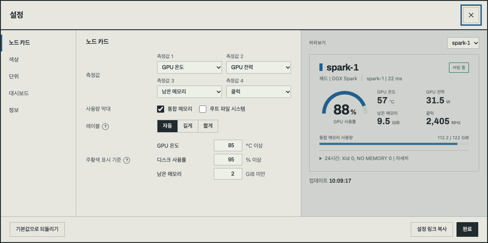

<h1 align="center">Spark Scope</h1>

<p align="center">NVIDIA DGX Spark 계열 장비와 그 위에서 돌아가는 vLLM, SGLang, TensorFold, llama.cpp, Strata 또는 oMLX 서버를 지켜보는<br>읽기 전용 모니터링 대시보드와 랙 패널입니다.<br>NVIDIA GPU가 있는 Linux 머신과 oMLX를 쓰는 Apple Silicon Mac도 지원합니다.</p>

<p align="center">
  <a href="https://github.com/juliankang4/spark-scope/releases/latest"></a>
  <a href="LICENSE"></a>
  
</p>

<p align="center"><a href="README.md">English</a> · <b>한국어</b></p>

<p align="center"><sub><code>docs/</code>의 자세한 문서는 영어판만 있습니다.</sub></p>

<p align="center"></p>

## 소개

Spark Scope는 NVIDIA DGX Spark 계열 장비(DGX Spark, ASUS Ascent GX10, MSI EdgeXpert 등 GB10 장비)와 그 위에서 실행 중인 추론 서버를 모니터링합니다. 노드 한 대부터 작은 클러스터까지 쓸 수 있습니다. DGX Spark 계열이 우선이지만 NVIDIA GPU가 있는 다른 Linux 머신과 Apple Silicon Mac도 지원합니다. Mac은 로컬이나 SSH로 수집하고 oMLX를 추론 서버로 읽습니다. 추론 서버 없이 Mac만 봐도 됩니다.

원래는 10인치 랙에 넣은 제 4노드 링(ASUS GX10 3대와 MSI EdgeXpert 1대)을 보려고 만들었습니다. 이 저장소에는 그 대시보드를 올렸습니다. 제 호스트 이름은 지웠고 노드 1대와 2대 구성에 맞게 레이아웃을 다시 짰습니다. GX10용 2U 랙 모듈은 [MakerWorld](https://makerworld.com/en/models/3380382)에 있습니다.

npm 의존성 없이 Node.js 프로세스 하나로 동작합니다. 각 노드에서 로컬이나 SSH로 데이터를 수집하고 추론 서버의 메트릭을 읽어 토큰 사용량을 SQLite에 기록합니다. 페이지는 두 개입니다. 하나는 `/`의 웹 대시보드(위 화면)이고 다른 하나는 바 디스플레이나 Raspberry Pi 키오스크에 띄우는 `/rack/`의 1920 x 480 랙 패널입니다.



- 읽기만 하고 노드에는 아무것도 설치하지 않습니다. 수집할 때마다 읽기 전용 셸 스크립트를 SSH로 보내고(로컬 노드는 직접 실행하고) 그 출력을 파싱합니다. 노드와 추론 서버에서는 아무것도 시작하거나 멈추거나 바꾸지 않습니다.
- 관측하지 못한 값은 0으로 채우지 않고 `unknown`(한국어 화면에서는 '알 수 없음')으로 표시합니다. 엔진이 제공하지 않는 항목은 숨깁니다.
- 페이지는 데스크톱, 휴대폰, 랙 디스플레이 어디서든 다른 호스트의 리소스를 불러오지 않습니다.

### 보여 주는 정보

- 노드: GPU 사용률, 온도, 전력, 클럭, 남은 GPU 메모리(GB10은 통합 메모리, 외장 GPU는 GPU 자체 메모리)를 보여 줍니다. 세부 정보에는 디스크, CPU, NVMe와 NIC 온도, thermal zone, 추론 컨테이너, 커널 오류가 나옵니다.
- 노드 간 연결: QSFP 케이블마다 두 논리 경로와 트래픽, 상태를 보여 줍니다(노드 2대 이상).
- 추론: 15분에서 6시간 범위의 출력 tok/s, prefill과 decode 속도, 최근 5분 TTFT와 TPOT p95, 캐시 적중률, KV cache, 대기열을 보여 줍니다.
- 토큰 사용량: 한 달 사용량을 내역, 달력, 차트로 보여 주고 모델별 표와 CSV 내보내기도 있습니다.
- 미니 창: 모델 테스트를 지켜볼 때 쓰는 작은 창입니다. '측정 시작'부터 '중지'까지를 한 번의 측정으로 기록합니다. Chrome과 Edge에서는 다른 창 위에 떠 있고, Safari와 휴대폰에서는 페이지 자체가 미니 창 화면으로 바뀝니다.
- 랙 패널: 토폴로지 순서상 앞쪽 노드 4대까지 베이가 하나씩 있고 하단 띠에 클러스터 상태, 모델, 처리량이 나옵니다.

자세한 내용은 [웹 페이지](docs/dashboard.md)와 [랙 패널](docs/rack.md) 문서에 있습니다. 스크린샷은 `tools/fixtures.mjs`의 가상 데이터로 찍었습니다.

## 설치

### 코딩 에이전트로 설치하기

Claude Code나 Codex 같은 코딩 에이전트에게 아래 설치 과정을 맡길 수 있습니다. 대시보드를 돌릴 머신에서 에이전트에 이 프롬프트를 그대로 붙여 넣으면 됩니다. 에이전트는 이 README를 따라가며 노드 구성을 묻고 노드와 추론 서버에는 손대지 않습니다.

```text
이 머신에 Spark Scope(https://github.com/juliankang4/spark-scope)를 설치해 줘. 저장소의 README.md에서
"Installation"과 "Applying it to your setup" 절을 따르고, 선택할 일이 생기면 먼저 나에게 물어봐.

1. 저장소를 ~/spark-scope(또는 내가 정하는 폴더)에 클론하고 `node --version`이 22.13 이상인지
   확인해. 그보다 낮으면 멈추고 README의 "Requirements" 절을 보여 줘.
2. 노드가 몇 대인지, 각 노드가 이 머신("local")인지 SSH로 접속하는지, SSH 별칭은 무엇인지 물어봐.
   노드가 2대 이상이면 케이블 연결도 물어봐. 그다음 examples/에서 가장 가까운 파일을 바탕으로
   ~/.config/spark-scope/topology.json을 만들고 나에게 보여 줘.
3. SSH 노드마다 `ssh -o BatchMode=yes <별칭> true`가 아무것도 묻지 않고 실행되는지 확인해.
   안 되면 "Several nodes over SSH"의 몇 번째 단계가 빠졌는지 알려 줘. key 생성, authorized_keys
   수정, 호스트 key 승인은 대신 하지 마.
4. 어떤 추론 서버(vLLM, SGLang, TensorFold, llama.cpp, Strata, oMLX 또는 없음)를 쓰는지, 그 URL과
   API 키가 필요한지 물어봐. 키가 필요해도 키 자체는 나에게 묻지 마. ~/.config/spark-scope/engine.env를
   권한 600으로 만들어 두고, SPARK_SCOPE_API_KEY=... 줄(서버가 여럿이면 apiKeyEnv에 적은 변수)은
   내가 직접 넣게 해 줘.
5. systemd가 있으면 "Running as a service" 절에 나온 대로 사용자 서비스를 등록해. WorkingDirectory,
   ExecStart(`command -v node`로 나온 경로), Environment= 줄을 채우고, engine.env가 있으면
   EnvironmentFile=로 읽게 해. 내가 따로 말하지 않으면 SPARK_SCOPE_HOST=127.0.0.1을 유지해.
   sudo가 필요한 명령은 실행하기 전에 물어봐. systemd가 없으면(예: macOS) 내가 직접 실행할
   `npm start` 명령을 알려 줘. 키는 README의 "vLLM, SGLang, TensorFold, llama.cpp, Strata or oMLX"
   절에 나온 방법으로 입력하게 해.
6. 실행되면 `curl -s http://127.0.0.1:8787/api/health`와 로그 마지막 몇 줄을 확인하고, 결과와
   열어 볼 주소를 알려 줘.

규칙: Spark Scope는 노드와 추론 서버에서 읽기만 해. 거기에 아무것도 설치하거나 바꾸지 말고,
시작하거나 멈추지도 마. API 키 같은 비밀은 명령 인자, 화면에 보여 주는 파일, 메시지, 그 밖의
어떤 출력에도 남기지 마.
```

아래는 직접 설치하는 순서입니다.

### 요구 사항

- Node.js 22.13 이상이 필요합니다(24 LTS 권장). 토큰 사용량 기록에 내장 `node:sqlite`를 쓰기 때문에, 이보다 오래된 Node에서는 서버가 이유를 알리는 메시지를 띄우고 멈춥니다. Ubuntu 24.04(DGX OS)와 Raspberry Pi OS의 `nodejs` 패키지는 버전이 너무 낮습니다. NodeSource에는 두 OS용 arm64 패키지와 x86 패키지가 모두 있습니다.

  ```bash
  curl -fsSL https://deb.nodesource.com/setup_24.x | sudo -E bash -
  sudo apt-get install -y nodejs
  ```

  nvm 같은 버전 관리자를 써도 됩니다. 일부 Node 버전은 시작할 때 "SQLite is an experimental feature" 경고를 띄우는데, 동작에는 문제가 없습니다.
- Linux 노드에는 `bash`, `nvidia-smi`, 기본 coreutils가 필요합니다. DGX OS에는 이미 다 들어 있습니다. `systemd`, `journalctl`, `docker`는 있으면 씁니다. Apple Silicon Mac은 macOS 기본 도구만 쓰고 sudo도 필요 없습니다. Mac에서 대시보드를 실행하려면 macOS arm64용 Node.js를 설치합니다.
- 원격 노드를 보려면 대시보드를 돌리는 머신에 SSH 클라이언트가 있어야 하고 각 노드에 key 기반 SSH로 접속할 수 있어야 합니다.
- 추론 서버는 선택 사항입니다. 메트릭을 내보내는 vLLM(메트릭이 기본으로 켜져 있음), SGLang(`--enable-metrics`로 시작), TensorFold(메트릭이 항상 켜져 있음), llama.cpp(`llama-server`를 `--metrics`로 시작), Strata(메트릭이 항상 켜져 있음), oMLX(상태 API 사용, 메트릭 옵션 불필요) 중 하나면 됩니다.

### Spark 없이 체험하기

```bash
git clone https://github.com/juliankang4/spark-scope.git
cd spark-scope
npm run demo
```

이렇게 실행하면 <http://127.0.0.1:8787/>에서 대시보드가, `/rack/`에서 랙 패널이, `/mini/`에서 미니 창이 열립니다. 모두 가상 데이터로 돌아갑니다. 아무것도 수집하거나 기록하지 않고, 다른 머신에 접속하지도 않습니다.

옵션: `npm run demo -- --nodes 2 --mode fault`는 노드 2대로 장애 상황을 보여 줍니다(모드: `serving`, `fault`, `idle`). `--servers 2`를 붙이면 노드를 모델 서버 2개로 나누고, `--off`를 더하면 마지막 서버를 끕니다. `--discrete`는 Spark 노드 뒤에 자체 VRAM을 가진 별도 GPU 워크스테이션을 추가합니다. 다른 포트를 쓰려면 `--port`를 붙입니다.

### 노드 1대: Spark에서 바로 실행

저장소에 들어 있는 `topology.json`은 로컬에서 수집하는 노드 1대(`"host": "local"`)를 정의하므로 SSH를 쓰지 않습니다.

```bash
git clone https://github.com/juliankang4/spark-scope.git
cd spark-scope
node --version          # 22.13 이상
SPARK_SCOPE_API_URL=http://127.0.0.1:8000 npm start
```

Spark에서 <http://127.0.0.1:8787/> 주소를 엽니다. 네트워크에 노출하지 않고 노트북에서 보려면, SSH로 포트를 포워딩한 뒤 노트북에서 같은 주소를 열면 됩니다.

```bash
ssh -L 8787:127.0.0.1:8787 you@your-spark
```

SGLang 기본 포트를 쓴다면 `SPARK_SCOPE_API_URL=http://127.0.0.1:30000`, TensorFold, llama.cpp, Strata라면 `http://127.0.0.1:8080`으로 지정합니다. 추론 서버가 없어도 노드 카드는 그대로 작동하고 추론 패널에는 `unknown`이나 `stopped`가 표시됩니다.

## 환경에 맞게 적용하기

### SSH로 여러 노드 연결

대시보드는 Spark 중 한 대에서 돌려도 되고(그 노드는 `"host": "local"`, 나머지는 SSH), 노드에 접속할 수 있는 다른 Linux나 macOS 머신에서 돌려도 됩니다(모든 노드를 SSH로 연결). 노드에는 아무것도 설치하지 않습니다. 수집할 때마다 읽기 전용 셸 스크립트를 SSH로 `bash -s`에 보내고 그 출력을 파싱합니다.

1. 대시보드 머신에서 전용 key를 만듭니다.

   ```bash
   ssh-keygen -t ed25519 -f ~/.ssh/id_ed25519_spark_scope -N "" -C spark-scope
   ```

2. 각 노드에서 key를 허용합니다. 대시보드가 접속할 계정의 `~/.ssh/authorized_keys`에 포워딩과 터미널을 막은 한 줄을 추가합니다.

   ```text
   no-port-forwarding,no-X11-forwarding,no-agent-forwarding,no-pty ssh-ed25519 AAAA...your-public-key... spark-scope
   ```

   이 옵션은 key가 터널, 에이전트 포워딩, 대화형 터미널에 쓰이지 않게 막습니다. 하지만 실행할 수 있는 명령까지 제한하지는 않습니다. 수집기에 셸이 필요하므로, 이 key로는 그 계정이 할 수 있는 일을 모두 할 수 있습니다. 그만한 권한을 줘도 괜찮은 계정을 써야 합니다. (`command="bash -s"`를 강제해도 보호가 늘지 않습니다. 스크립트가 stdin으로 들어오기 때문입니다.)

3. 대시보드 머신의 `~/.ssh/config`에 노드마다 SSH 별칭을 추가합니다. `topology.json`의 `host`에는 이 별칭을 씁니다.

   ```text
   Host spark-2
       HostName spark-2.lan              # 이름 해석이 되는 호스트 이름 또는 IP 주소
       User your-user
       IdentityFile ~/.ssh/id_ed25519_spark_scope
       IdentitiesOnly yes
       # 선택: 이 호스트 key를 평소 쓰는 known_hosts와 따로 보관합니다. 4단계에서 처음
       # 접속하기 전에 넣어야 그때 승인한 key가 이 파일에 저장됩니다.
       UserKnownHostsFile ~/.ssh/known_hosts_spark_scope
       # 선택: 5초마다 하는 수집에 연결 하나를 재사용합니다.
       ControlMaster auto
       ControlPath ~/.ssh/spark-scope-%C
       ControlPersist 10m
   ```

4. 호스트 key를 확인한 뒤 한 번씩 승인합니다. 수집기는 SSH를 `BatchMode=yes`로 실행하므로, 모르는 호스트 key나 바뀐 호스트 key를 만나면 묻지 않고 수집이 실패합니다. 직접 한 번 접속해서, 그때 나오는 fingerprint를 노드에서 확인한 값과 비교합니다. 노드에서는 `ssh-keygen -lf /etc/ssh/ssh_host_ed25519_key.pub`로 확인합니다.

   ```bash
   ssh spark-2 true
   ssh -o BatchMode=yes spark-2 'nvidia-smi -L'   # 아무것도 묻지 않고 실행돼야 합니다
   ```

   모든 노드를 승인했다면 `Host` 블록에 `StrictHostKeyChecking yes`를 추가해도 됩니다. 그러면 호스트 key가 바뀌었을 때 승인을 묻지 않고 거부합니다.

5. 클러스터 구성을 적습니다. 예제를 설정 디렉터리에 복사해서 고치면 됩니다. 거기에 두면 `git pull`을 해도 고친 내용과 충돌하지 않습니다.

   ```bash
   mkdir -p ~/.config/spark-scope
   cp examples/topology.2-node.json ~/.config/spark-scope/topology.json
   npm start
   ```

   `examples/`에는 노드 1대, 노드 2대(케이블 2개), 노드 3대와 4대 링 구성 예제가 있습니다. 노드마다 `id`와 `host`(SSH 별칭 또는 `"local"`)가 있고 `name`, `role`, `hardware`는 선택입니다. 링크에는 양쪽 끝마다 두 논리 경로(plane)의 네트워크 인터페이스를 적습니다. 필드, 인터페이스 이름, 링크 상태는 [토폴로지](docs/topology.md) 문서에서 설명합니다.

노드 쪽 권한 중 두 가지는 선택 사항입니다. 커널 오류 요약을 보려면 커널 저널(`journalctl -k`)을 읽을 수 있어야 합니다. root가 아닌 계정은 `systemd-journal`이나 `adm` 그룹에 넣으면 됩니다. 이 권한이 없으면 패널에 "커널 진단 정보 없음"이 표시됩니다. 컨테이너 세부 정보를 보려면 Docker 소켓에 접근할 수 있어야 합니다. 그런데 `docker` 그룹 멤버십은 root 권한과 같으므로, 이 대시보드만 보려고 그 권한을 주어서는 안 됩니다. 권한이 없으면 컨테이너 세부 정보가 나오지 않습니다.

### vLLM, SGLang, TensorFold, llama.cpp, Strata 또는 oMLX

`SPARK_SCOPE_API_URL`에 추론 서버 주소를 지정합니다. 여러 노드로 서빙한다면 API가 떠 있는 노드를 가리켜야 합니다. 엔진 종류는 서버 응답을 보고 알아내므로 따로 설정할 것이 없습니다.

| 엔진 | 준비 | 표시하지 않거나 다르게 표시하는 항목 |
|---|---|---|
| vLLM | 메트릭이 기본으로 켜져 있습니다. | 추측 디코딩 수락률은 추측 디코딩을 켰을 때만 나옵니다. |
| SGLang | `--enable-metrics`로 시작합니다. | vLLM과 같습니다. |
| TensorFold | 메트릭이 항상 켜져 있습니다. | 네이티브 1.0.2는 캐시 카운터를 내보내지 않아 캐시 적중률과 캐시 읽기를 숨깁니다. Prefill은 2초 구간 속도입니다. |
| llama.cpp | `llama-server`를 `--metrics`로 시작합니다. 진행 중 출력 속도를 보려면 `/slots`를 켜 둡니다(기본값). | TTFT와 완료 요청 수가 없습니다. TPOT p95 대신 평균 Decode 시간을, KV cache 대신 컨텍스트 사용률을 보여 줍니다. |
| Strata | 메트릭이 항상 켜져 있습니다. | KV cache 대신 컨텍스트 사용률을 보여 줍니다. |
| oMLX | 옵션이 필요 없습니다. 상태 API를 읽습니다. | 실시간 출력 속도, TTFT, TPOT, KV cache, 캐시 읽기 속도, 추측 디코딩 수락률이 없습니다. Prefill과 Decode는 완료된 요청의 평균입니다. |

엔진 패널과 미니 창은 엔진이 제공하는 항목만 표시합니다. 수치마다 어떻게 측정하는지는 [추론 엔진](docs/configuration.md#inference-engines) 항목에 정리했습니다.

수집 요청은 모델을 로드하지 않습니다. 유휴 상태인 Strata, oMLX, llama.cpp 서버가 모델을 내리는 것도 막지 않습니다. oMLX 카운터는 서버 전체의 합계라서, 로드된 모델이 1개 이하일 때 모델 라벨과 원장에는 `default_model`을 씁니다.

엔진에 키가 필요하면 대시보드의 환경 변수 `SPARK_SCOPE_API_KEY`에 넣습니다. URL이나 `topology.json`에서는 키를 읽지 않습니다. Bash 터미널에서 다음 명령을 쓰면 키를 화면에 표시하거나 셸 기록에 남기지 않고 입력할 수 있습니다.

```bash
read -r -s -p 'Engine API key: ' SPARK_SCOPE_API_KEY
printf '\n'
export SPARK_SCOPE_API_KEY
npm start
```

키는 모든 엔진 GET 요청에 Bearer 헤더로 실려 가므로, 신뢰하는 loopback 주소나 HTTPS로만 보냅니다. 유효한 키가 없으면 oMLX는 `oMLX needs an API key` 오류를 표시합니다. loopback에 바인딩한 oMLX에 키가 설정되지 않았다면 대시보드 키도 필요 없습니다. oMLX의 `skip_api_key_verification` 설정도 loopback에서만 쓸 수 있는 대안이지만, admin 경로까지 열립니다. 자세한 내용은 [oMLX](docs/configuration.md#omlx) 항목에 있습니다.

노드를 그룹으로 나눠 따로 서빙한다면(케이블로 연결한 노드 2대가 각자 자기 모델을 돌리거나, 4대를 2 + 2로, 3대를 2 + 1로 나눈 경우) `SPARK_SCOPE_API_URL` 대신 `topology.json`에 그룹마다 모델 서버를 적고 API와 노드를 지정합니다.

```json
"servers": [
  { "id": "a", "api": "http://spark-1:8000", "apiKeyEnv": "ENGINE_A_TOKEN", "nodes": ["1", "2"] },
  { "id": "b", "api": "http://spark-3:30000", "apiKeyEnv": "ENGINE_B_TOKEN", "nodes": ["3", "4"] }
]
```

`apiKeyEnv`는 선택 사항이며 키 값이 아닌 환경 변수 이름을 적습니다. 서버가 여러 개일 때 이 항목이 없는 서버에는 키를 보내지 않습니다. `SPARK_SCOPE_API_KEY`를 모든 서버에 공유하지 않습니다.

그러면 대시보드 하나에서 모든 서버를 봅니다. 상태 줄 바로 아래 띠가 서버마다 한 칸씩 나뉘고 차트의 선과 엔진 패널도 서버마다 하나씩 생깁니다(설정에서 한 번에 하나씩만 보게 할 수도 있습니다). 랙 패널 하단 띠에는 서버마다 칩이 붙고 토큰 원장은 모든 서버가 하나를 함께 씁니다. 필드와 규칙은 [모델 서버](docs/topology.md#model-servers) 항목에 정리했습니다.

### Apple Silicon Mac 노드

저장소의 1노드 토폴로지는 Mac에서도 그대로 쓸 수 있습니다. Mac에서 `SPARK_SCOPE_API_URL=http://127.0.0.1:8000 npm start`를 실행하면 로컬 노드와 기본 포트의 oMLX를 읽습니다. oMLX에 키가 필요하면 위의 환경 변수를 씁니다. 다른 머신에서 Mac을 수집하려면 `host`에 Mac의 SSH 별칭을 넣습니다. 별도 도구나 관리자 권한은 필요 없습니다.

Mac 카드에는 GPU 사용률과 시스템 공유 메모리가 나옵니다. macOS는 root 권한 없이 GPU 온도, GPU 전력, 클럭을 알려 주지 않으므로, 그 칸에는 같은 자리에 다른 값을 보여 줍니다. 온도 칸에는 열 상태, 전력 칸에는 MacBook의 시스템 전력(배터리가 없는 Mac은 스왑 사용량), 클럭 칸에는 GPU 메모리 사용량이 나옵니다. NVMe와 NIC 칸에는 각각 스왑 사용량과 압축 메모리가 나옵니다. 수집에 실패해도 칸 위치와 라벨은 유지하고 값만 알 수 없음으로 표시합니다. Linux 전용 진단은 숨기고 메모리 경고는 OS의 메모리 압력 수준을 따릅니다. 시스템 전력은 약 1분마다 갱신되며 GPU 전력 합계에는 포함하지 않습니다. 자세한 내용은 [Mac 노드](docs/configuration.md#mac-nodes) 문서에 있습니다.

### 서비스로 실행

`systemd/spark-scope.service.example`은 placeholder가 들어 있는 systemd user unit입니다. 이 파일을 `~/.config/systemd/user/spark-scope.service`로 복사하고 `WorkingDirectory`, `ExecStart`(`command -v node`로 나오는 경로), `Environment=` 줄을 고친 다음 아래 명령을 실행합니다.

```bash
systemctl --user daemon-reload
systemctl --user enable --now spark-scope
journalctl --user -u spark-scope -f
sudo loginctl enable-linger "$USER"   # 로그인 세션 없이도 계속 실행
```

엔진 API 키는 unit 파일에 적지 않습니다. 내 계정만 읽을 수 있는 파일(`chmod 600`), 예를 들어 `~/.config/spark-scope/engine.env`에 `SPARK_SCOPE_API_KEY=...` 줄을 넣고 `[Service]` 절에 `EnvironmentFile=%h/.config/spark-scope/engine.env`를 추가해 읽게 합니다.

나중에 업데이트할 때는 `git pull --ff-only`를 실행하고 서비스를 다시 시작하면 됩니다. `~/.config/spark-scope/`의 토폴로지와 `~/.local/share/spark-scope/`의 토큰 사용량 기록은 그대로 남습니다. 릴리스에 맞춰 바꿔야 할 설정이 있으면 [CHANGELOG.md](CHANGELOG.md)에 적어 둡니다.

### 랙 패널 키오스크

바 디스플레이를 단 Raspberry Pi로 부팅하자마자 `/rack/`을 전체 화면으로 띄울 수 있습니다. `kiosk/`에 스크립트, autostart 항목, 포인터를 숨기는 labwc 규칙이 있습니다. Pi에서 대시보드를 직접 돌려도 되고 다른 곳에서 돌아가는 대시보드를 띄우기만 해도 됩니다. 설치 순서, 디스플레이 크기, 주소 옵션은 [랙 패널](docs/rack.md#raspberry-pi-kiosk) 문서를 보면 됩니다.

## DeepSeek Harness 플러그인(dsh-spark-scope)

[dsh-spark-scope](https://github.com/juliankang4/dsh-spark-scope)는 [DeepSeek Harness](https://github.com/deepseek-ai/deepseek-harness)(dsh) 왼쪽 사이드바에 미니 창의 Glance 화면을 띄우는 플러그인입니다. 작업하면서 노드와 모델 서버를 함께 볼 수 있습니다. 브라우저(`dsh web`)와 Desktop 앱에서 모두 작동합니다.

<p align="center"></p>

```bash
dsh plugin --profile web add dsh-spark-scope
```

설치한 뒤 dsh 설정의 Spark Scope 탭에서 대시보드 주소를 입력합니다. 데이터는 dsh가 직접 가져오므로, dsh를 실행하는 컴퓨터에서 그 주소로 접속할 수 있어야 합니다. localhost, IP 주소, 대시보드 머신의 호스트 이름이 아닌 이름을 쓰려면 `SPARK_SCOPE_ALLOWED_HOSTS`에 추가합니다. 플러그인은 `/api/state`를 읽기만 합니다. 설정 방법과 자세한 내용은 플러그인 [README](https://github.com/juliankang4/dsh-spark-scope#readme)에 있습니다.

## 설정

<p align="center"></p>

톱니바퀴 버튼을 누르면 설정이 열립니다.

- 노드 카드: 측정값 네 개와 그 순서, 사용량 막대, 레이블 길이(길게 또는 짧게), 주황색 표시 기준을 정합니다.
- 색상: 노드마다 색을 팔레트에서 고르거나 직접 선택합니다.
- 단위: °C 또는 °F, GiB 또는 GB, 24시간제 또는 12시간제를 고릅니다.
- 대시보드: 언어(English 또는 한국어), 표시할 패널, 차트 기간, 새로 고침 간격, 디자인(기본, 콘솔, 소프트), 테마를 정합니다.
- 랙 패널: 하단 띠 움직임을 정하고 현재 설정이 담긴 키오스크 URL을 볼 수 있습니다.

설정은 브라우저마다 따로 저장됩니다. "설정 링크 복사"를 쓰면 다른 브라우저로 옮길 수 있습니다. 자세한 내용은 [웹 페이지](docs/dashboard.md#settings) 문서에 있습니다.

서버 자체는 환경 변수로 설정합니다. 보통 필요한 변수는 아래 표에 있습니다.

| 변수 | 기본값 | 용도 |
|---|---|---|
| `SPARK_SCOPE_API_URL` | `http://127.0.0.1:8000` | 추론 서버입니다. vLLM과 oMLX는 8000, SGLang은 30000, TensorFold, llama.cpp, Strata는 8080 포트를 씁니다. |
| `SPARK_SCOPE_API_KEY` | 없음 | 서버가 하나일 때 사용할 Bearer 키. 환경 변수에서만 읽습니다. |
| `SPARK_SCOPE_HOST` | `127.0.0.1` | listen 주소입니다. `0.0.0.0`으로 두면 다른 머신에서도 접속할 수 있습니다. [보안](#보안)을 함께 봐야 합니다. |
| `SPARK_SCOPE_PORT` | `8787` | listen 포트입니다. |
| `SPARK_SCOPE_TOPOLOGY` | `~/.config/spark-scope/topology.json` | 토폴로지 파일입니다. 이 파일이 없으면 저장소에 들어 있는 노드 1대용 `topology.json`을 씁니다. |

토큰 사용량 기록의 시간대와 수집 간격을 포함한 전체 목록은 [구성](docs/configuration.md) 문서에, JSON 엔드포인트는 [HTTP API](docs/api.md) 문서에 있습니다.

## 보안

- 인증도 TLS도 없습니다. 포트에 접근할 수 있으면 누구나 노드 이름, SSH 별칭, 모델 이름, 커널 오류 메시지, 토큰 수를 볼 수 있습니다.
- 서버는 기본으로 `127.0.0.1`에서만 연결을 받습니다. SSH 포트 포워딩을 쓰거나, 네트워크에 있는 모든 사람을 믿을 수 있을 때만 LAN이나 Tailscale 같은 사설 오버레이 네트워크에 엽니다. 인터넷에는 노출하지 마세요. 인증을 붙인 원격 접속이 필요하면 인증 기능이 있는 리버스 프록시 뒤에 둡니다.
- 자기 호스트 이름으로 온 요청만 받습니다. `Host` 헤더에 다른 사이트 이름이 적힌 요청은 거부합니다(HTTP 403). 그래서 다른 곳의 웹 페이지가 자기 도메인을 이 머신 주소로 돌려(DNS rebinding) 방문자의 브라우저로 API를 읽어 갈 수 없습니다. localhost, IP 주소, 이 머신의 호스트 이름은 따로 설정하지 않아도 접속됩니다. 리버스 프록시 이름 같은 다른 이름은 `SPARK_SCOPE_ALLOWED_HOSTS`에 추가합니다.
- 모든 응답에 Content-Security-Policy가 붙습니다. 이 정책은 서버 자신의 스크립트, 스타일, 폰트, 요청만 허용하고 다른 페이지가 프레임으로 넣는 것도 막습니다.
- SSH key로는 그 key로 로그인하는 계정이 할 수 있는 명령을 모두 실행할 수 있습니다. 전용 key와 위의 `authorized_keys` 옵션을 쓰고 그만한 권한을 줘도 괜찮은 계정을 고르세요.
- 엔진 API 키는 서버 안에만 둡니다. 페이지로 보내거나 로그에 쓰지 않습니다.

취약점 제보 방법은 [SECURITY.md](SECURITY.md)에 있습니다.

## 제한 사항

- 노드마다 `nvidia-smi`가 보고하는 첫 번째 GPU만 표시하며 VRAM도 그 GPU 기준이라, GPU가 여러 장인 기기는 GPU 0만 보입니다. GB10 시스템은 GPU가 한 장입니다.
- TSOC와 TS1P 온도, A/B 논리 경로 구성은 DGX Spark 계열 하드웨어에만 있습니다. NVIDIA GPU가 있는 다른 Linux 머신에서는 이 부분이 `unknown`으로 나오거나 그에 맞는 토폴로지가 필요합니다.
- 네이티브 TensorFold 파서는 캡처한 메트릭을 재생해 검사합니다. 대시보드를 실제 서버에 연결하는 검사는 포함하지 않습니다.
- 차트 데이터는 메모리에 6시간 동안 보관하며 서버가 다시 시작되거나 서빙 중인 모델이 바뀌면 초기화됩니다. 토큰 사용량 기록은 디스크에 남고 카운터 증가분을 더해 집계합니다. 재시작을 어떻게 처리하는지는 [토큰 사용량](docs/dashboard.md#token-ledger) 문서에 적었습니다.

## 기여

pull request를 열기 전에 읽어야 할 내용은 [CONTRIBUTING.md](CONTRIBUTING.md)에, 테스트와 렌더링 검사는 [개발](docs/development.md) 문서에, 릴리스별 변경 사항은 [CHANGELOG.md](CHANGELOG.md)에 있습니다.

## 라이선스

MIT 라이선스입니다. 전문은 [LICENSE](LICENSE)에 있습니다. `public/fonts/`의 폰트(Archivo, Bebas Neue)는 자체 라이선스인 SIL Open Font License 1.1을 따르며 라이선스 전문이 같은 폴더에 있습니다.
