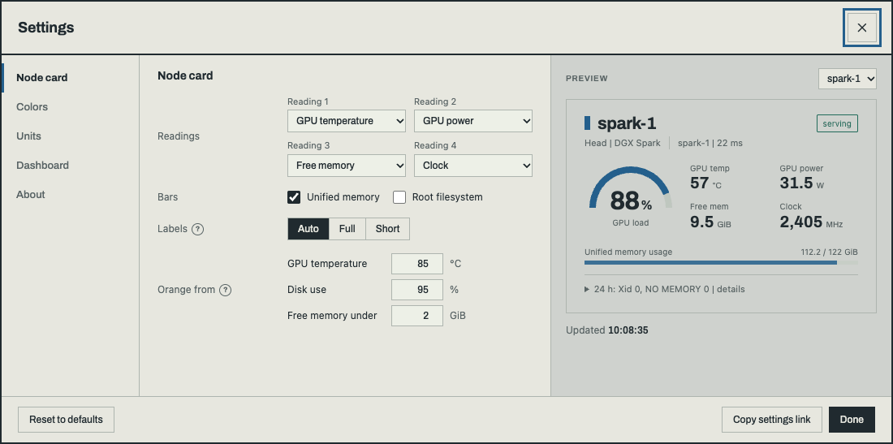

<h1 align="center">Spark Scope</h1>

<p align="center">A read-only dashboard and rack panel for NVIDIA DGX Spark-class machines<br>and the vLLM, SGLang, TensorFold or llama.cpp server running on them.</p>

<p align="center">
  <a href="https://github.com/juliankang4/spark-scope/releases/latest"></a>
  <a href="https://github.com/juliankang4/spark-scope/actions/workflows/ci.yml"></a>
  <a href="LICENSE"></a>
  
  
  
</p>

<p align="center"><b>English</b> · <a href="README.ko.md">한국어</a></p>

<p align="center"></p>

## About

Spark Scope watches NVIDIA DGX Spark-class machines (DGX Spark, ASUS Ascent GX10, MSI EdgeXpert and other GB10 boxes) and the vLLM, SGLang, TensorFold or llama.cpp server running on them, from a single node to a small cluster.

I wrote it for my own four-node ring (three ASUS GX10s and an MSI EdgeXpert) in a 10-inch rack. This repository is that dashboard with my hostnames taken out and the layout reworked for one and two nodes. The 2U rack modules for the GX10 are on [MakerWorld](https://makerworld.com/en/models/3380382).

It is one Node.js process with no npm dependencies. It polls each node (locally or over SSH), reads the inference server's Prometheus metrics, keeps a token ledger in SQLite and serves two pages: the web dashboard at `/` (above) and a 1920 x 480 rack panel at `/rack/` for a bar display or a Raspberry Pi kiosk:


- **Read-only, no agent on the nodes.** Each poll sends a read-only shell script over SSH (or runs it locally) and parses the output. Nothing on a node or the inference server is started, stopped or changed.
- **Unknown stays unknown.** A value that was not observed reads `unknown`, not zero.
- **Nothing from other hosts.** The pages work on a desktop, a phone and a rack display without loading anything from elsewhere.

### What it shows

- **Nodes**: GPU load, temperature, power, clock and free GPU memory (unified memory on a GB10, the card's own on a discrete GPU), with disk, CPU, NVMe and NIC temperatures, thermal zones, the inference container and kernel errors in the details.
- **Interconnect**: each QSFP cable's two planes, traffic and state (two or more nodes).
- **Inference**: output tok/s over 15 minutes to 6 hours, prefill and decode rates, TTFT and TPOT p95 over the last 5 minutes, cache hit, KV cache and queue.
- **Token ledger**: one month as a statement, a calendar or charts, with a table by model and a CSV export.
- **Mini window**: a small view for watching a model test, with runs recorded between Start and Stop. It stays on top of other windows in Chrome and Edge; in Safari and on phones the page switches to it.
- **Rack panel**: a bay per node and a band with the cluster state, model and throughput.

More in [Web page](docs/dashboard.md) and [Rack panel](docs/rack.md). The screenshots use synthetic data from `tools/fixtures.mjs`.

## Installation

### Requirements

- Node.js 22.13 or later (24 LTS recommended). The token ledger uses the built-in `node:sqlite`, and the server stops with a clear message on an older Node. The `nodejs` packages of Ubuntu 24.04 (DGX OS) and Raspberry Pi OS are too old. NodeSource has arm64 and x86 packages for both:

  ```bash
  curl -fsSL https://deb.nodesource.com/setup_24.x | sudo -E bash -
  sudo apt-get install -y nodejs
  ```

  A version manager such as nvm works too. Some Node versions print an "SQLite is an experimental feature" warning on start; it is harmless.
- On each monitored node: Linux with `bash`, `nvidia-smi` and the usual coreutils. DGX OS already has everything. `systemd`, `journalctl` and `docker` are used when present.
- For remote nodes: an SSH client on the dashboard machine and key-based SSH access to each node.
- Optionally an inference server with Prometheus metrics: vLLM (on by default), SGLang (start it with `--enable-metrics`), TensorFold (always on) or llama.cpp (start `llama-server` with `--metrics`).

### Try it without a Spark

```bash
git clone https://github.com/juliankang4/spark-scope.git
cd spark-scope
npm run demo
```

This serves the dashboard at <http://127.0.0.1:8787/>, with the rack panel at `/rack/` and the mini window at `/mini/`, all on made-up data. `npm run demo -- --nodes 2 --mode fault` shows two nodes with a fault (modes: `serving`, `fault`, `idle`); `--servers 2` splits the nodes into two model servers (`--off` switches the last one off); `--discrete` adds a separate GPU workstation with its own VRAM after the Sparks; `--port` picks another port. Nothing is collected or written, and no other machine is contacted.

### One node: the dashboard on the Spark itself

The shipped `topology.json` describes a single node collected locally (`"host": "local"`), so no SSH is involved.

```bash
git clone https://github.com/juliankang4/spark-scope.git
cd spark-scope
node --version          # 22.13 or later
SPARK_SCOPE_API_URL=http://127.0.0.1:8000 npm start
```

Open <http://127.0.0.1:8787/> on the Spark. To look at it from your laptop without exposing it on the network, forward the port over SSH and open the same address locally:

```bash
ssh -L 8787:127.0.0.1:8787 you@your-spark
```

Use `SPARK_SCOPE_API_URL=http://127.0.0.1:30000` for SGLang's default port and `http://127.0.0.1:8080` for TensorFold or llama.cpp. If no inference server is running, the node card still works and the inference panels read `unknown` or `stopped`.

## Applying it to your setup

### Several nodes over SSH

The dashboard can run on one of the Sparks (that node uses `"host": "local"`, the others SSH) or on any other Linux or macOS machine that can reach them (every node uses SSH). Nothing is installed on the nodes: each poll sends a read-only shell script to `bash -s` over SSH and parses its output.

1. **Create a dedicated key** on the dashboard machine:

   ```bash
   ssh-keygen -t ed25519 -f ~/.ssh/id_ed25519_spark_scope -N "" -C spark-scope
   ```

2. **Authorize it on each node** by appending one line to `~/.ssh/authorized_keys` of the account the dashboard will use, with forwarding and terminals disabled:

   ```text
   no-port-forwarding,no-X11-forwarding,no-agent-forwarding,no-pty ssh-ed25519 AAAA...your-public-key... spark-scope
   ```

   These options stop the key from being used for tunnels, agent forwarding or an interactive terminal. They do not limit which commands it can run: the collector needs a shell, so the key can run anything that account can. Use an account whose privileges you are comfortable with. (A forced `command="bash -s"` would not add protection, because the script arrives on stdin.)

3. **Add an SSH alias** per node in `~/.ssh/config` on the dashboard machine. The alias is what `topology.json` calls `host`:

   ```text
   Host spark-2
       HostName spark-2.lan              # a resolvable name or an IP address
       User your-user
       IdentityFile ~/.ssh/id_ed25519_spark_scope
       IdentitiesOnly yes
       # Optional: keep these host keys apart from your everyday known_hosts. Set it before the first
       # connection in step 4, so the key you accept there is stored in this file.
       UserKnownHostsFile ~/.ssh/known_hosts_spark_scope
       # Optional: reuse one connection for the polls every five seconds.
       ControlMaster auto
       ControlPath ~/.ssh/spark-scope-%C
       ControlPersist 10m
   ```

4. **Accept each host key once, after checking it.** The collector runs SSH with `BatchMode=yes`, so an unknown or changed host key makes the poll fail instead of prompting. Connect once by hand and compare the fingerprint with the node's own (`ssh-keygen -lf /etc/ssh/ssh_host_ed25519_key.pub` on the node):

   ```bash
   ssh spark-2 true
   ssh -o BatchMode=yes spark-2 'nvidia-smi -L'   # must work without any prompt
   ```

   Once every node is accepted, you can add `StrictHostKeyChecking yes` to the `Host` blocks, so a changed host key is refused instead of offered.

5. **Describe the cluster** by copying an example to your config directory and editing it. Keeping it there means `git pull` never conflicts with your edits:

   ```bash
   mkdir -p ~/.config/spark-scope
   cp examples/topology.2-node.json ~/.config/spark-scope/topology.json
   npm start
   ```

   `examples/` has one-node, two-node (two cables) and three- and four-node ring layouts. Each node has an `id`, a `host` (an SSH alias or `"local"`) and optional `name`, `role` and `hardware`; each link names the network interface of both planes at each end. Fields, interface names and link states: [Topology](docs/topology.md).

Optional permissions on the nodes: kernel error summaries need read access to the kernel journal (`journalctl -k`), which non-root accounts get through the `systemd-journal` or `adm` group. Without it the panel says "Kernel diagnostics unavailable". Container details need access to the Docker socket. Membership of the `docker` group is equivalent to root, so do not grant it just for this dashboard. Without it, container details are not shown.

### vLLM, SGLang, TensorFold or llama.cpp

Point `SPARK_SCOPE_API_URL` at the inference server; in multi-node serving, at the node that hosts the API. vLLM's and TensorFold's metrics are on by default. Start SGLang with `--enable-metrics` and llama.cpp with `--metrics`. llama.cpp also needs its default-enabled `/slots` endpoint for live output speed; with slots disabled or unavailable, that speed reads `unknown` while requests run. Some engine readings are measured differently or unavailable, listed under [Inference engines](docs/configuration.md#inference-engines). Other engines are recognised on the node cards, but their metrics are not read.

When the nodes serve in separate groups (two cabled nodes each running its own model, four as 2 + 2, three as 2 + 1), list each group as a model server in `topology.json` with its API and nodes instead of setting `SPARK_SCOPE_API_URL`:

```json
"servers": [
  { "id": "a", "api": "http://spark-1:8000", "nodes": ["1", "2"] },
  { "id": "b", "api": "http://spark-3:30000", "nodes": ["3", "4"] }
]
```

One dashboard then shows every server: a row per server above the chart, a line and an engine panel for each (or one at a time, in the settings), chips on the rack panel's band, and one token ledger for all of them. Fields and rules: [Model servers](docs/topology.md#model-servers).

### Running as a service

`systemd/spark-scope.service.example` is a systemd user unit with placeholders. Copy it to `~/.config/systemd/user/spark-scope.service`, adjust `WorkingDirectory`, `ExecStart` (the path from `command -v node`) and the `Environment=` lines, then:

```bash
systemctl --user daemon-reload
systemctl --user enable --now spark-scope
journalctl --user -u spark-scope -f
sudo loginctl enable-linger "$USER"   # keep it running without a login session
```

To update later, `git pull --ff-only` and restart the service. Your topology in `~/.config/spark-scope/` and the ledger in `~/.local/share/spark-scope/` stay as they are; [CHANGELOG.md](CHANGELOG.md) notes anything a release asks you to change.

### Rack panel kiosk

A Raspberry Pi with a bar display can show `/rack/` full screen from boot: `kiosk/` has the script, the autostart entry and a labwc rule that hides the pointer. The Pi can run the dashboard itself or show one that runs elsewhere. Steps, display sizes and address options: [Rack panel](docs/rack.md#raspberry-pi-kiosk).

## Settings

<p align="center"></p>

The gear button opens the settings:

- **Node card**: the four readings and their order, the bars, full or short labels, the levels that turn a reading orange.
- **Colors**: a colour per node, from the palette or custom.
- **Units**: °C or °F, GiB or GB, a 24- or 12-hour clock.
- **Dashboard**: English or Korean, which panels to show, the chart range, the refresh interval, the design (Default, Console or Soft) and the theme.
- **Rack panel**: band motion and the kiosk URL with the current settings.

They are kept per browser; "Copy settings link" carries them to another one. Details: [Web page](docs/dashboard.md#settings).

The server itself is set with environment variables. The ones most setups need:

| Variable | Default | Purpose |
|---|---|---|
| `SPARK_SCOPE_API_URL` | `http://127.0.0.1:8000` | The inference server (vLLM listens on 8000, SGLang on 30000, TensorFold and llama.cpp on 8080). |
| `SPARK_SCOPE_HOST` | `127.0.0.1` | Listen address. `0.0.0.0` serves other machines; see [Security](#security). |
| `SPARK_SCOPE_PORT` | `8787` | Listen port. |
| `SPARK_SCOPE_TOPOLOGY` | `~/.config/spark-scope/topology.json` | Topology file (the shipped one-node `topology.json` when that does not exist). |

All of them, including the ledger's time zone and the poll intervals: [Configuration](docs/configuration.md). The JSON endpoints: [HTTP API](docs/api.md).

## Security

- **No authentication and no TLS.** Anyone who can reach the port can see node names, SSH aliases, model names, kernel error messages and token counts.
- **Localhost by default.** The server binds to `127.0.0.1`. Use SSH port forwarding, or expose it on a LAN or a private overlay network such as Tailscale only if you trust everyone on it. Do not expose it to the internet; if you need remote access with authentication, put it behind a reverse proxy that provides it.
- **Only its own host names.** Requests whose `Host` header names another site are refused (HTTP 403), so a web page elsewhere cannot point its own domain at this machine (DNS rebinding) and read the API through a visitor's browser. localhost, IP addresses and this machine's hostname work out of the box; add other names, such as a reverse proxy's, with `SPARK_SCOPE_ALLOWED_HOSTS`.
- **No outside resources.** Every response carries a Content-Security-Policy that allows only the server's own scripts, styles, fonts and requests, and forbids framing.
- **The SSH key can run commands** as the account it logs in to. Use a dedicated key, the `authorized_keys` options above and an account you are comfortable with.

To report a vulnerability, see [SECURITY.md](SECURITY.md).

## Limitations

- Only the first GPU reported by `nvidia-smi` is shown per node, its VRAM included; a machine with several GPUs shows GPU 0. GB10 systems have one.
- TSOC/TS1P temperatures and the A/B plane layout are specific to DGX Spark-class hardware. Other Linux machines with an NVIDIA GPU mostly work, but those parts read `unknown` or need a matching topology.
- One inference server per dashboard.
- Charts are kept in memory for six hours and reset when the server restarts or the served model changes. The token ledger is kept on disk and adds up counter increases; how it handles restarts: [Token ledger](docs/dashboard.md#token-ledger).

## Contributing

See [CONTRIBUTING.md](CONTRIBUTING.md) before opening a pull request, [Development](docs/development.md) for the tests and the render check, and [CHANGELOG.md](CHANGELOG.md) for what changed between releases.

## License

MIT, see [LICENSE](LICENSE). The fonts in `public/fonts/` (Archivo and Bebas Neue) keep their own license, the SIL Open Font License 1.1, with its text next to them.
