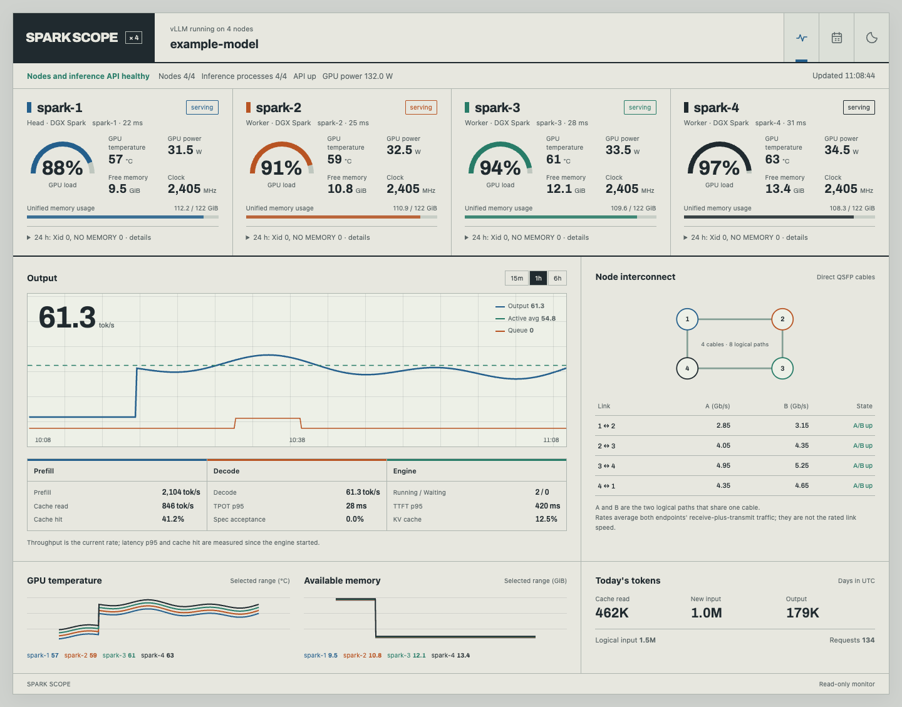
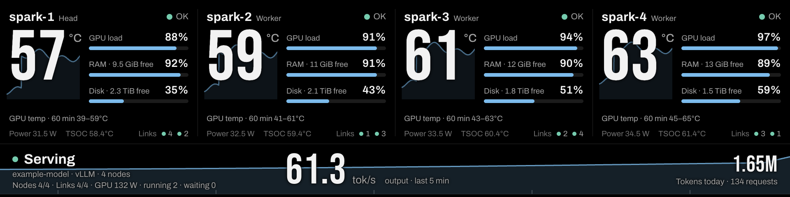
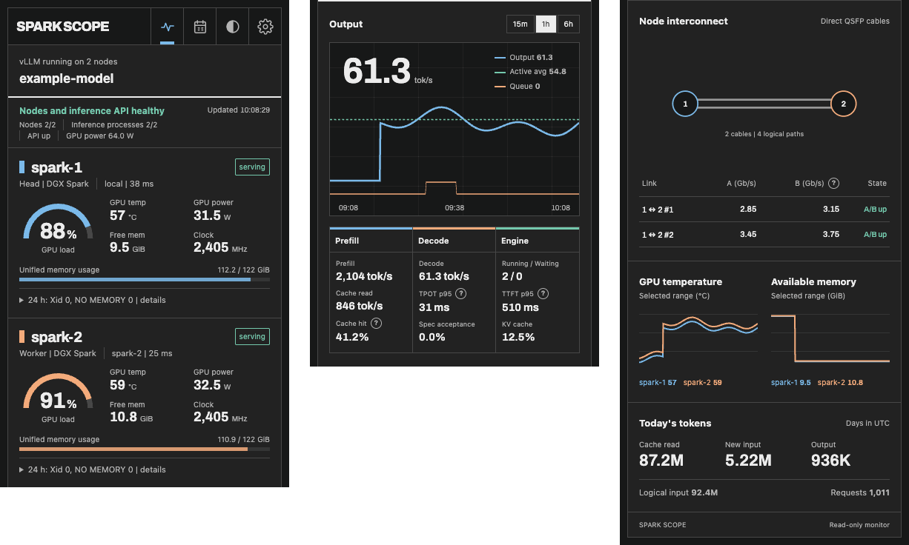

<h1 align="center">Spark Scope</h1>

<p align="center">A read-only dashboard and rack panel for NVIDIA DGX Spark-class machines<br>and the vLLM or SGLang server running on them.</p>

<p align="center">
  <a href="https://github.com/juliankang4/spark-scope/releases/latest"></a>
  <a href="https://github.com/juliankang4/spark-scope/actions/workflows/ci.yml"></a>
  <a href="LICENSE"></a>
  
  
  
  
</p>

<p align="center"></p>

## About

Spark Scope watches NVIDIA DGX Spark-class machines (DGX Spark, ASUS Ascent GX10, MSI EdgeXpert and other GB10 boxes) and the vLLM or SGLang server running on them. It works with a single node or a small cluster.

I wrote it for my own four-node ring (three ASUS GX10s and an MSI EdgeXpert) in a 10-inch rack. This repository is that dashboard with my hostnames taken out and the layout reworked for one and two nodes. The 2U rack modules for the GX10 are on [MakerWorld](https://makerworld.com/en/models/3380382).

It is one Node.js process with no npm dependencies. It polls each node (locally or over SSH), reads the inference server's Prometheus metrics, keeps a token ledger in SQLite and serves two pages: the web dashboard at `/` (above) and a 1920 x 480 rack panel at `/rack/` for a bar display or a Raspberry Pi kiosk:



- **No agent on the nodes.** Each poll sends a read-only shell script over SSH (or runs it locally) and parses the output.
- **Read-only.** It never starts, stops or changes anything on a node or the inference server.
- **Unknown stays unknown.** A value that was not observed reads `unknown`, not zero.
- **Nothing from other hosts.** The pages work on a desktop, a phone and a rack display without loading anything from elsewhere.

The screenshots use synthetic data from `tools/fixtures.mjs`.

## Installation

### Requirements

- Node.js 22.13 or later (24 LTS recommended). The token ledger uses the built-in `node:sqlite`, and the server stops with a clear message on an older Node. The `nodejs` packages of Ubuntu 24.04 (DGX OS) and Raspberry Pi OS are too old. NodeSource has arm64 and x86 packages for both:

  ```bash
  curl -fsSL https://deb.nodesource.com/setup_24.x | sudo -E bash -
  sudo apt-get install -y nodejs
  ```

  A version manager such as nvm works too. Some Node versions print an "SQLite is an experimental feature" warning on start; it is harmless.
- On each monitored node: Linux with `bash`, `nvidia-smi` and the usual coreutils. DGX OS already has everything. `systemd`, `journalctl` and `docker` are used when present.
- For remote nodes: an SSH client on the dashboard machine and key-based SSH access to each node.
- Optionally an inference server with Prometheus metrics: vLLM (on by default) or SGLang (start it with `--enable-metrics`).

### Quick start: one node, dashboard on the Spark itself

The shipped `topology.json` describes a single node collected locally (`"host": "local"`), so no SSH is involved.

```bash
git clone https://github.com/juliankang4/spark-scope.git
cd spark-scope
node --version          # 22.13 or later
SPARK_SCOPE_API_URL=http://127.0.0.1:8000 npm start
```

Open <http://127.0.0.1:8787/> on the Spark. To look at it from your laptop without exposing it on the network, forward the port over SSH and open the same address locally:

```bash
ssh -L 8787:127.0.0.1:8787 you@your-spark
```

Use `SPARK_SCOPE_API_URL=http://127.0.0.1:30000` for SGLang's default port. If no inference server is running, the node card still works and the inference panels read `unknown` or `stopped`.

### Multi-node setup (SSH)

The dashboard can run on one of the Sparks (that node uses `"host": "local"`, the others SSH) or on any other Linux or macOS machine that can reach them (every node uses SSH). Nothing is installed on the nodes: each poll sends a read-only shell script to `bash -s` over SSH and parses its output.

1. **Create a dedicated key** on the dashboard machine:

   ```bash
   ssh-keygen -t ed25519 -f ~/.ssh/id_ed25519_spark_scope -N "" -C spark-scope
   ```

2. **Authorize it on each node** by appending one line to `~/.ssh/authorized_keys` of the account the dashboard will use, with forwarding and terminals disabled:

   ```text
   no-port-forwarding,no-X11-forwarding,no-agent-forwarding,no-pty ssh-ed25519 AAAA...your-public-key... spark-scope
   ```

   These options stop the key from being used for tunnels, agent forwarding or an interactive terminal. They do not limit which commands it can run: the collector needs a shell, so the key can run anything that account can. Use an account whose privileges you are comfortable with. (A forced `command="bash -s"` would not add protection, because the script arrives on stdin.)

3. **Add an SSH alias** per node in `~/.ssh/config` on the dashboard machine. The alias is what `topology.json` calls `host`:

   ```text
   Host spark-2
       HostName spark-2.lan              # a resolvable name or an IP address
       User your-user
       IdentityFile ~/.ssh/id_ed25519_spark_scope
       IdentitiesOnly yes
       # Optional: keep these host keys apart from your everyday known_hosts. Set it before the first
       # connection in step 4, so the key you accept there is stored in this file.
       UserKnownHostsFile ~/.ssh/known_hosts_spark_scope
       # Optional: reuse one connection for the polls every five seconds.
       ControlMaster auto
       ControlPath ~/.ssh/spark-scope-%C
       ControlPersist 10m
   ```

4. **Accept each host key once, after checking it.** The collector runs SSH with `BatchMode=yes`, so an unknown or changed host key makes the poll fail instead of prompting. Connect once by hand and compare the fingerprint with the node's own (`ssh-keygen -lf /etc/ssh/ssh_host_ed25519_key.pub` on the node):

   ```bash
   ssh spark-2 true
   ssh -o BatchMode=yes spark-2 'nvidia-smi -L'   # must work without any prompt
   ```

   Once every node is accepted, you can add `StrictHostKeyChecking yes` to the `Host` blocks, so a changed host key is refused instead of offered.

5. **Describe the cluster** by copying an example to your config directory and editing it (see the next section). Keeping it there means `git pull` never conflicts with your edits:

   ```bash
   mkdir -p ~/.config/spark-scope
   cp examples/topology.2-node.json ~/.config/spark-scope/topology.json
   npm start
   ```

Optional permissions on the nodes: kernel error summaries need read access to the kernel journal (`journalctl -k`), which non-root accounts get through the `systemd-journal` or `adm` group. Without it the panel says "Kernel diagnostics unavailable". Container details need access to the Docker socket. Membership of the `docker` group is equivalent to root, so do not grant it just for this dashboard. Without it, container details are not shown.

### Running as a service

`systemd/spark-scope.service.example` is a systemd user unit with placeholders. Copy it to `~/.config/systemd/user/spark-scope.service`, adjust `WorkingDirectory`, `ExecStart` (the path from `command -v node`) and the `Environment=` lines, then:

```bash
systemctl --user daemon-reload
systemctl --user enable --now spark-scope
journalctl --user -u spark-scope -f
sudo loginctl enable-linger "$USER"   # keep it running without a login session
```

## What it shows

<p align="center"></p>
<p align="center"><sub>The web dashboard on a phone (dark theme, two nodes joined by two cables), top to bottom in three parts.</sub></p>

**Scope tab**

- **Node cards.** GPU load, temperature, power, SM clock and free unified memory. A details panel adds free disk, inference process memory, CPU load (1-minute load average and core count), NVMe and ConnectX NIC chip temperatures, every ACPI thermal zone by its firmware name (on GB10 boards TSOC, TS0E, TS0P, TS1E, TS1P, TGPU and TUNC), system state and failed units, the inference container, the TP rank and NVIDIA kernel errors (Xid, `NV_ERR_NO_MEMORY`) from the last 24 hours. Sensors, the container and the TP rank only appear when the node reports them. The badge colour follows the node's state: serving (green), idle, no GPU data (orange), no response (red) or not collected. The status line adds up the GPU power of all nodes. GB10 systems expose no fan speed and no whole-system power, so neither is shown.
- **Node interconnect** (two or more nodes). A diagram and a table of every QSFP cable: the state of each logical plane (A/B), measured traffic in Gb/s, and whether the link is up, partially up, down, slow or not cabled yet. Slow and partial links are drawn orange, down links red. Node ids longer than ten characters are shortened in the diagram (the full id shows on hover). A single node has no such panel.
- **Inference.** Output tok/s over 15 minutes, 1 hour or 6 hours, with the active average and the queue. Below it: prefill, cache-read and decode rates, TTFT and TPOT p95, prefix-cache hit rate, KV-cache use, speculative-decoding acceptance and running/waiting requests.
- **Trends.** GPU temperature and available memory per node, and today's token totals.

**Token ledger tab**

Daily and monthly totals of logical input, new (computed) input, cache-read input, output and requests, the last seven days of output, and a month picker. The ledger is stored on disk. Everything else resets when the server restarts.

A new ledger starts from what the engine reports at that moment: tokens served before the dashboard first ran are not booked. A counter the engine does not export (vLLM without per-source prompt counters, for example) reads as `unknown` in the ledger rather than 0. If the ledger file cannot be opened, token counting is switched off and the rest of the dashboard keeps working.

The page follows the viewer's light or dark setting. The header button cycles through the other theme, the system's theme picked by hand, and back to following the system. It works on phones and shows times in the viewer's time zone. A tab in the background stops polling and catches up, chart history included, as soon as it is shown again. A value that was not observed shows as `unknown`, never as zero.

**Rack panel (`/rack/`)**

A dark 1920 x 480 panel for a bar display or a Raspberry Pi kiosk. Each node gets a bay with its GPU temperature (with the last hour drawn behind it), GPU load, memory and disk use, power, TSOC and a coloured dot per link. The bottom band shows the cluster state, the model and engine, node and link counts with the total GPU power, output tok/s over the last five minutes and today's tokens. See [Rack panel and kiosk](#rack-panel-and-kiosk).

## Topology (`topology.json`)

`topology.json` maps dashboard cards to machines and cables to network interfaces. The server reads it at start; restart after editing. It uses the first of these that exists:

1. the file named by `SPARK_SCOPE_TOPOLOGY` (an error if it is missing),
2. `$XDG_CONFIG_HOME/spark-scope/topology.json` (normally `~/.config/spark-scope/topology.json`),
3. the shipped `topology.json` next to `server.mjs` (one locally collected node),
4. a built-in single local node named after the machine.

| Example | Layout |
|---|---|
| `examples/topology.1-node.json` | One node, collected locally. Same as the shipped `topology.json`. |
| `examples/topology.2-node.json` | Two nodes joined by two cables (port 0 to port 0, port 1 to port 1). The dashboard runs on `spark-1`; `spark-2` is polled over SSH. Delete the second link if you use one cable. |
| `examples/topology.3-node.json` | Three-node ring polled over SSH. Each node's port 0 goes to the next node's port 1. |
| `examples/topology.4-node.json` | Four-node ring polled over SSH, same cabling pattern. |

Node fields:

| Field | Required | Meaning |
|---|---|---|
| `id` | yes | Short unique id (letters, digits, `_`, `-`; up to 16). Shown in the interconnect diagram. |
| `name` | no | Display name on the card (defaults to `id`). |
| `host` | yes, unless `collect` is false | `"local"` to run the collector on this machine without SSH, or an SSH destination: a `~/.ssh/config` alias (recommended), a hostname, an address or `user@host`. |
| `local` | no | `true` is the same as `"host": "local"`. At most one node can be local. |
| `role` | no | `HEAD`, `WORKER` or anything else; shown under the name. |
| `hardware` | no | Free text shown under the name, for example `DGX Spark`, `ASUS Ascent GX10` or `MSI EdgeXpert`. |
| `collect` | no | `false` shows a card without contacting the node (for a machine that is not set up yet). Its links can still be judged from the other end. |
| `inference` | no | `false` lets this node run without an inference process while the API serves, without degrading the status. |
| `expectedRank` | no | If set, the TP rank parsed from the node's GPU process name must match it. |

Link fields:

| Field | Required | Meaning |
|---|---|---|
| `ends` | yes | Exactly two objects `{ "node": "<id>", "a": "<netdev>", "b": "<netdev>" }`. `a` and `b` are the interfaces of the two logical planes on that end; either may be omitted. |
| `id` | no | Unique id. Defaults to `<node>-<node>`, numbered when several cables join the same pair. |
| `label` | no | Display label. Defaults to `<node>–<node>`, plus `#1`, `#2` for parallel cables. |
| `cabled` | no | `false` for a cable that is not installed yet: dark ports read "not cabled yet" instead of "down" and do not degrade the status. |

On a DGX Spark-class machine each QSFP port of the ConnectX-7 appears as two network interfaces on different PCIe domains. Port 0 is `enp1s0f0np0` (plane A) and `enP2p1s0f0np0` (plane B); port 1 is `enp1s0f1np1` and `enP2p1s0f1np1`. Check yours with `ip -br link` or `ibdev2netdev`, and find which port a cable uses with `cat /sys/class/net/<interface>/carrier` while plugging it in. Traffic is read from the matching RoCE counters (`rocep1s0f0` and so on) when RDMA devices exist, otherwise from the interface statistics. Links run at 200 Gb/s per plane on these machines; a lower negotiated speed is flagged as slow (see `SPARK_SCOPE_LINK_MIN_GBPS`).

A plane is up when every end that could be observed has carrier. One observed end is enough, because a direct-attach cable only has carrier while its peer is up. A link that no collected node can see is `unknown`, not down, and so is a link with a plane neither end can see while nothing is dark: that usually means a mistyped interface name, so check the names if a link stays `unknown`. Each interface can appear only once in the whole topology; naming it for two planes or two links is rejected at startup.

## Configuration

All settings are optional environment variables.

| Variable | Default | Purpose |
|---|---|---|
| `SPARK_SCOPE_HOST` | `127.0.0.1` | Listen address. Set `0.0.0.0` (or a specific address) to serve other machines; see Security. |
| `SPARK_SCOPE_PORT` | `8787` | Listen port. |
| `SPARK_SCOPE_API_URL` | `http://127.0.0.1:8000` | Base URL of the OpenAI-compatible inference server. The dashboard reads `/health`, `/metrics` and `/v1/models`. vLLM listens on 8000 by default, SGLang on 30000. |
| `SPARK_SCOPE_TOPOLOGY` | `~/.config/spark-scope/topology.json` if it exists, otherwise `topology.json` next to `server.mjs` | Topology file. When set explicitly, a missing file is an error. |
| `SPARK_SCOPE_USAGE_DB` | `$XDG_DATA_HOME/spark-scope/usage.sqlite` (`~/.local/share/...`) | Token ledger database. The directory is created if needed. |
| `SPARK_SCOPE_TIME_ZONE` | the server's time zone | IANA time zone (for example `America/Los_Angeles`) that decides where ledger days begin. The page shows it next to the ledger. |
| `SPARK_SCOPE_NODE_INTERVAL_MS` | `5000` | Node polling interval in milliseconds, at least 1000. Each poll is limited to 4.5 seconds, and each `nvidia-smi` or `docker` call in it to 1.5 seconds. |
| `SPARK_SCOPE_API_INTERVAL_MS` | `2000` | Inference metrics polling interval in milliseconds, at least 500. |
| `SPARK_SCOPE_LINK_MIN_GBPS` | `200` | Per-plane speed below which an up link counts as slow. |
| `SPARK_SCOPE_ALLOWED_HOSTS` | none | Extra host names the pages may be opened under, comma-separated (`dash.example.org`); an entry starting with `.` allows a whole domain (`.lab.example`), `*` turns the check off. localhost, IP addresses and this machine's hostname (also `<hostname>.local` and `<hostname>.<tailnet>.ts.net`) always work; see Security. |

Example for a two-node cluster whose head serves SGLang, viewed from the LAN:

```bash
SPARK_SCOPE_HOST=0.0.0.0 SPARK_SCOPE_API_URL=http://127.0.0.1:30000 npm start
```

## Inference engines

- **vLLM**: read directly from its `vllm:*` metrics.
- **SGLang**: its `sglang:*` metrics are mapped onto the same fields. Run SGLang with `--enable-metrics`. Differences: decode and output speed come from SGLang's own throughput gauge while requests are running, because SGLang adds a request's output tokens to its counter only when the request finishes; prefill time uses SGLang's time-to-first-token histogram (it includes queue time), TPOT uses its inter-token latency histogram, the cache hit rate is cached prompt tokens over all prompt tokens since start, and speculative acceptance is SGLang's recent-window gauge rather than a lifetime ratio.
- Other engines (llama.cpp, Ollama, TensorRT-LLM, Triton) are recognised by process or image name on the node cards, but their throughput and token metrics are not read.

The engine label comes from the metric names or the GPU process name, and the number of serving nodes from how many nodes run a GPU process; neither is assumed. In multi-node serving point `SPARK_SCOPE_API_URL` at the node that hosts the API.

## Rack panel and kiosk

Open `/rack/` (for example <http://127.0.0.1:8787/rack/>). The panel is laid out at 1920 x 480 and scales to fit the window, so it suits the common 1920 x 480 bar displays and works, letterboxed, on anything else. It polls `/api/state` every 2 seconds without the history and fetches the 60-minute history every 30 seconds for the temperature traces and the band's earlier samples. When the server stops answering, the bays and the band dim and the band stops moving. The page reloads itself every 12 hours, right after a successful health check, so it picks up updates without touching the kiosk.


<p align="center"><sub>One node not responding and its two links down: the bays name the cause, the band keeps the counts.</sub></p>


<p align="center"><sub>A single node gets one wide bay.</sub></p>

- **Layout by node count.** Three or four nodes share the width. Two nodes get two centred bays. A single node gets one wide bay with its meters side by side and no link dots. With two cables between two nodes, each bay shows a numbered dot per cable (`2 #1`, `2 #2`). When a bay would be narrower than 460 logical pixels (five or more nodes at 1920, or a narrow `?width`), the bays switch to a compact layout: the name above the status, the temperature above the meters, smaller type, and link dots without peer names. A long node name is cut short with an ellipsis before the status is. Peer names next to the link dots are left out when an id is longer than six characters; give links a short `label` in `topology.json` if their default label (`<id>–<id>`) is long.
- **What the bays and the band say.** Each bay header shows its most severe condition: no response, missing GPU readings (`nvidia-smi stuck`, `GPU query timed out`, `GPU query failed`, `no nvidia-smi`), thermal slowdown, a link problem (`Link 2–3 down`, `Link 1–2 #2 down`, `Link 1–2 not cabled`), system state or failed units, a missing inference process while the API serves, disk at 95% or more, less than 2 GiB of free memory, or (for ten minutes) a container restart or a kernel error. The band shows the cluster title (Serving, Ready, Inference stopped, Inference down, Nodes unreachable), the model with its engine, node and link counts and up to two notes.
- **Other display sizes.** Without a parameter the panel is scaled to fit and centred, with even black borders. `?width=N` (800 to 3840) lays it out N pixels wide instead of 1920, still 480 tall, so a display of another aspect ratio is filled edge to edge: use N = 480 x display width / display height (for example `?width=2560` for 2560 x 480 or 1280 x 240, `?width=819` for a 1024 x 600 screen). Below 1440 the bottom band uses smaller type.

### Raspberry Pi kiosk (Raspberry Pi OS, labwc/Wayland)

The `kiosk/` folder has the three pieces. The Pi can run the dashboard itself or only show a dashboard that runs elsewhere.

1. Install the script and make it executable:

   ```bash
   mkdir -p ~/.local/bin ~/.config/autostart ~/.config/labwc
   install -m 755 kiosk/spark-scope-kiosk ~/.local/bin/spark-scope-kiosk
   ```

2. Autostart it with the desktop session: copy `kiosk/spark-scope-kiosk.desktop` to `~/.config/autostart/`, replace `YOUR_USER` with your account name and set the URL. `lwrespawn` (part of Raspberry Pi OS) restarts the kiosk if Chromium exits. The desktop must log in automatically (`sudo raspi-config`, System Options, Boot / Auto Login, Desktop Autologin).

3. Hide the mouse pointer: merge the `<windowRule>` from `kiosk/labwc-rc.xml` into the `<windowRules>` of `~/.config/labwc/rc.xml` (if you have no such file, copy `kiosk/labwc-rc.xml` there) and reload labwc with `kill -HUP $(pgrep -x labwc)`, or log out and in. The page hides the cursor itself, but on Wayland that only takes effect once the pointer enters the window; the labwc rule moves the pointer into the kiosk window and hides it. It matches only the kiosk (the script starts Chromium with `--class=spark-scope-kiosk`), so other Chromium windows keep their pointer. If you used the earlier `identifier="chromium*"` rule, change it to `spark-scope-kiosk`.

4. Set the screen resolution and rotation in Raspberry Pi OS's Screen Configuration. If the panel does not fill the display, add `?width=N` to the URL as described above.

The script waits until `/api/health` answers before it opens Chromium (printing a line once a minute while it waits), uses its own Chromium profile under `~/.local/share/spark-scope-kiosk`, and takes `SPARK_SCOPE_RACK_URL` and `CHROMIUM` from the environment. It turns off the renderer accessibility that Raspberry Pi OS switches on for every Chromium (`--force-renderer-accessibility` in `/etc/chromium.d`): the panel has no screen reader or input, and the accessibility tree is rebuilt on every redraw.

**Showing a dashboard that runs on another machine.** Point `SPARK_SCOPE_RACK_URL` at it, for example `http://dashboard-host:8787/rack/` on the LAN or the machine's Tailscale name or address on a tailnet. The dashboard must then listen beyond localhost (`SPARK_SCOPE_HOST=0.0.0.0` or that interface's address), which exposes it to everyone on that network; see Security. To keep the dashboard on localhost instead, forward the port from the Pi with SSH (for example a user service running `ssh -N -L 8787:127.0.0.1:8787 dashboard-host`) and keep the default URL.

## HTTP API

- `GET /` and `GET /rack/`: the web dashboard and the rack panel.
- `GET /api/state?minutes=15|60|360[&history=0]`: the full dashboard state as JSON (gzip-compressed when the client accepts it; `history=0` leaves out the samples, which the pages request every 2 seconds while fetching the full history every 30 seconds): `topology` (nodes and links, without interface names), `nodes` keyed by node id, `ringLinks` keyed by link id (`state` is `up`, `partial`, `down`, `pending` or `unknown`), `inference` (the inference metrics the pages show, for vLLM and SGLang; also sent under its earlier name `vllm` for scripts written against earlier versions; that alias will be removed in a later release), `serving`, `usage`, `history`, `historyStats`, plus `status`, `message`, `inferenceState`, `startedAt`, `updatedAt` and `pollIntervals` (the node and API poll intervals, which the page uses to decide when data is stale). It leaves out what the pages do not show: the engine URL and local model path, interface names and raw SSH error text (a failed node carries a short `error` such as `timed out` or `SSH authentication failed`; the full message is in the server log).
- `GET /api/health`: `status`, `message` and `updatedAt`; HTTP 503 when nothing can be reached.
- `GET /api/usage?month=YYYY-MM`: one month of the token ledger.

## Security

- **No authentication and no TLS.** Anyone who can reach the port can see node names, SSH aliases, model names, kernel error messages and token counts.
- **Only its own host names.** Requests whose `Host` header names another site are refused (HTTP 403, logged once per name), so a web page elsewhere cannot point its own domain at this machine (DNS rebinding) and read the API through a visitor's browser. localhost, IP addresses and this machine's hostname work out of the box; add other names, such as a reverse proxy's, with `SPARK_SCOPE_ALLOWED_HOSTS`.
- **No outside resources.** Every response carries a Content-Security-Policy that allows only the server's own scripts, styles, fonts and requests, and forbids framing.
- **Localhost by default.** The server binds to `127.0.0.1`. Use SSH port forwarding, or expose it on a LAN or a private overlay network such as Tailscale only if you trust everyone on it. Do not expose it to the internet; if you need remote access with authentication, put it behind a reverse proxy that provides it.
- **Read-only.** The node script only reads system state (`nvidia-smi` queries, `/proc`, `/sys`, `df`, `systemctl` status, `journalctl -k`, `docker ps`/`inspect`); it never starts, stops or changes anything. The inference server is only read through `GET` requests. The pages load nothing from other hosts.
- **The SSH key can run commands** as the account it logs in to (see the multi-node setup). Use a dedicated key, the `authorized_keys` options above and an account you are comfortable with.
- Topology values are validated before they reach SSH or the script (interface names, host aliases), and SSH never prompts.

## Limitations

- Only the first GPU reported by `nvidia-smi` is shown per node, which matches GB10 systems.
- TSOC/TS1P temperatures and the A/B plane layout are specific to DGX Spark-class hardware. Other Linux machines with an NVIDIA GPU mostly work, but those parts read `unknown` or need a matching topology.
- One inference server per dashboard.
- Charts are kept in memory for six hours and reset when the server restarts or the served model changes.
- The token ledger adds up counter increases. Tokens served while the dashboard is down are counted when it returns. After an engine restart the new run counts from its own start: vLLM reports its start time, and for SGLang, which does not, a restart is recognised when its counters fall below the last values seen. If an SGLang run restarted while the dashboard was down and has already passed those values, the part of the previous run the dashboard never saw is lost. Latency p95 values are since engine start, not a rolling window, and are interpolated inside the engine's histogram buckets (as Prometheus' `histogram_quantile` does), so their precision depends on the bucket bounds.
- A node whose `nvidia-smi` hangs, fails or is missing is shown as such (and degrades the cluster status) rather than as healthy with blank readings. A poll that hits its 4.5-second limit keeps the readings that arrived and is marked incomplete.
- The page treats data older than three poll intervals (at least 20 seconds) as stale by comparing the server's timestamp with the viewer's clock, so a viewer clock that is far off shows the server as not responding.
- Numbers use one fixed format (`1,234.5`) whatever the viewer's locale; token counts use three significant digits (`1.5K`, `9.55M`, `1.06B`) on both pages. Times and dates follow the viewer's locale and time zone.
- The rack panel is designed for 1920 x 480; other sizes are scaled to fit or set with `?width=`. Bays narrower than 460 logical pixels use the compact layout, and below about 200 pixels per bay (five or more nodes on a small screen) labels are cut short.

## Development

```bash
npm test
node tools/render.mjs        # needs Chrome or Chromium; CI runs it too
```

The tests use only `node:test` and cover topology parsing and validation (one-node, two-cable and ring layouts), link and cluster status, the collector script with fake `nvidia-smi` and `ssh` commands (hangs, failures, missing binaries), metric parsing for vLLM and SGLang against a fake engine, the token ledger, the chart history, the browser-side formatting and layout helpers, the rack panel's view logic, the kiosk script, and a running server (routes, host checks, security headers, path tricks sent over a raw socket, what the browser payload leaves out). They do not contact any other machine. CI runs them on Node 22.13 and 24, on x64 and arm64, runs the render check below and runs `shellcheck` on the kiosk script.

`tools/render.mjs` serves the pages with synthetic data (`tools/fixtures.mjs`) and the server's security headers, and renders the rack panel and the web dashboard in headless Chrome through the DevTools protocol: one to six nodes, the longest ids and names, a 2560 x 480 bar, a 1024 x 600 screen and a phone. Chrome runs with its background services off, so nothing but the local fixture server is contacted. It writes PNGs to `$OUT` (default: a `spark-scope-renders` folder in the system temp directory) and reports clipped or overlapping text, overflow, script errors and Content-Security-Policy violations. Set `CHROME` if Chrome is not found, and `COUNTS=1,2` to limit the node counts. The screenshots in this README come from it.

See [CONTRIBUTING.md](CONTRIBUTING.md) before opening a pull request, [SECURITY.md](SECURITY.md) for reporting a vulnerability and [CHANGELOG.md](CHANGELOG.md) for what changed between releases.

## Fonts

`public/fonts/` bundles latin subsets of Archivo (text and numbers) and Bebas Neue (the rack panel's large figures), each under the SIL Open Font License 1.1 with its license text next to it. They keep that license whatever license applies to the rest of Spark Scope. Without them the pages fall back to the system UI font.

## License

MIT, see [LICENSE](LICENSE). The bundled fonts keep their own license (SIL Open Font License 1.1, see [Fonts](#fonts)).
