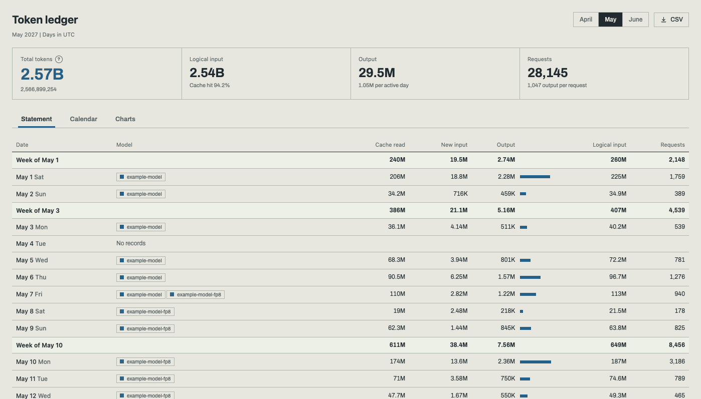
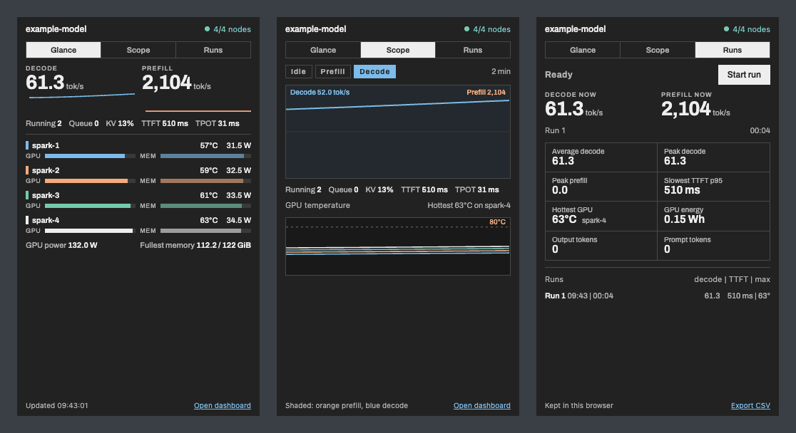

# Web page

[README](../README.md) · [Topology](topology.md) · [Configuration](configuration.md) · **Web page** · [Rack panel](rack.md) · [HTTP API](api.md) · [Development](development.md)

The web dashboard at `/` has two tabs, Scope and Token ledger, plus a mini window and the settings. It follows the viewer's light or dark setting, works on phones and shows times in the viewer's time zone.

The dashboard on a phone (dark theme, two nodes joined by two cables), top to bottom in three parts.

## Scope

- **Node cards.** GPU load and four readings, by default GPU temperature, GPU power, free unified memory and SM clock (the settings change them), with a unified memory bar. The details panel adds free disk, inference process memory, CPU load (1-minute load average and core count), NVMe and ConnectX NIC chip temperatures, every ACPI thermal zone by its firmware name (on GB10 boards TSOC, TS0E, TS0P, TS1E, TS1P, TGPU and TUNC), system state and failed units, the inference container, the TP rank and NVIDIA kernel errors (Xid, `NV_ERR_NO_MEMORY`) from the last 24 hours. Sensors, the container and the TP rank only appear when the node reports them. GB10 systems expose no fan speed and no whole-system power, so neither is shown.
- **Badge and status line.** The badge colour follows the node's state: serving (green), idle, no GPU data (orange), no response (red) or not collected. The status line sums up the nodes and the API and adds the GPU power of all nodes.
- **Node interconnect** (two or more nodes). A diagram and a table of every QSFP cable: the state of each logical plane (A/B), measured traffic in Gb/s, and whether the link is up, partially up, down, slow or not cabled yet. Slow and partial links are drawn orange, down links red. Node ids longer than ten characters are shortened in the diagram (the full id shows on hover).
- **Inference.** Output tok/s over 15 minutes, 1 hour or 6 hours, with the active average and the queue. Below it: prefill, cache-read and decode rates, TTFT and TPOT p95 over the requests that finished in the last 5 minutes (with no finished requests they read `no requests`; the value since the engine started is in the explanation behind the `?`), prefix-cache hit rate, KV-cache use, speculative-decoding acceptance and running/waiting requests.
- **Trends.** GPU temperature and available memory per node, and today's token totals.

A round `?` next to a label (memory units, the latency figures, cache hit, the link table, total tokens, the change against the previous month) explains it on hover, focus or tap.

## Token ledger

One month at a time, picked with the month buttons (on a phone, a list), under a row of figures: total tokens, today's output and requests (current month only), logical input with its cache hit rate, output with its average per day of use, requests with output per request, and the change against the same days of the previous month (when the ledger covers that month from its first day).

- **Statement** (the default): each day with its model and token counts, grouped by week with subtotals and the month's total.
- **Calendar**: the days shaded by output, a mark where the model changed, and the picked day's figures.
- **Charts**: logical input and output per day on separate scales across the whole month, and the running total against the previous month.

A table by model sits under every view, and the CSV button saves the month with one row per day and model.

The ledger is stored on disk (`SPARK_SCOPE_USAGE_DB`); everything else resets when the server restarts. How it counts:

- A new ledger starts from what the engine reports at that moment: tokens served before the dashboard first ran are not booked.
- It adds up counter increases. Tokens served while the dashboard is down are counted when it returns.
- After an engine restart the new run counts from its own start. vLLM reports its start time; for SGLang and TensorFold, which do not, a restart is recognised when their counters fall below the last values seen. If such a run restarted while the dashboard was down and has already passed those values, the part of the previous run the dashboard never saw is lost.
- A counter the engine does not export (vLLM without per-source prompt counters, for example) reads as `unknown` rather than 0.
- With several [model servers](topology.md#model-servers), every server is counted into the one ledger, each with its own runs, so two servers running the same model never mix their counters. The first server keeps the runs the ledger had before servers were listed; keep the server that used to be `SPARK_SCOPE_API_URL` first.
- If the ledger file cannot be opened, token counting is switched off and the rest of the dashboard keeps working.

Days begin at midnight in `SPARK_SCOPE_TIME_ZONE` (the server's time zone by default), which the page shows next to the ledger.

## Mini window

The button after the two tabs (or the `M` key) opens a small window to keep beside other windows while testing a model:

- **Glance**: decode and prefill with five-minute sparklines, running and queued requests, KV cache, TTFT and TPOT p95, and a line per node (temperature, power, GPU and memory bars).
- **Scope**: the last two minutes of decode and prefill, prefill and decode shaded, with the node temperatures underneath.
- **Runs**: records a test between Start and Stop: average and peak decode, peak prefill, the slowest TTFT p95, the hottest GPU, GPU energy and tokens, each compared with the run before. Runs are kept in the browser and exported as CSV.

Chrome and Edge keep the mini window on top of other windows (document picture-in-picture); other browsers open it as a small window at `/mini/`. It follows the page's design, theme, units, node colours and language, and is not offered on phones and tablets.

## Settings

The gear button at the right of the header opens the settings. A preview card shows one node with each change as it is made.

- **Node card**: the four readings on every card and their order (GPU temperature, GPU power, free memory, clock, disk used, free disk, CPU load, NVMe or NIC temperature, process memory), the bars (unified memory, root filesystem), full or short labels (Auto uses the short ones on narrow cards so no label wraps) and the levels at which a reading or bar turns orange (GPU temperature, disk use, free memory; display only, the rack panel keeps its own).
- **Colors**: each node's colour from the theme's palette or a custom one, with a warning when a custom colour is hard to see on either theme. It is used on the node's card, in the charts and in the interconnect diagram.
- **Units**: temperatures in °C or °F, memory and disk in GiB or GB, a 24- or 12-hour clock.
- **Dashboard**: the language, which panels to show (interconnect, engine, trends, today's tokens), the chart range the page opens with, how often it refreshes (2, 5 or 10 s), whether a hidden tab pauses its updates (on by default), the design and the theme.
- **Rack panel**: band motion and the kiosk URL with the current units, language and colours, to copy into the kiosk's `SPARK_SCOPE_RACK_URL`. The section appears once a rack panel has read the server in the last 7 days; otherwise Dashboard offers to show it.
- **About**: the version, the engine and the node count.

Designs: Default, Console (a terminal look, always dark) and Soft (rounded cards with a ring gauge, light and dark). The theme button in the header cycles through the other theme, the system's theme picked by hand, and back to following the system.

The settings are kept in this browser only, so each browser has its own. "Copy settings link" gives an address that carries them to another browser, for example `/?temp=f&readings=temp,power,disk,clock&bars=unified,disk&lang=ko`; opening it applies them once and drops them from the address. Nothing in the settings changes the server.

## Language

The pages are in English, with Korean as the other choice: Settings, Dashboard, Language on the web page (it applies at once and travels in a settings link as `lang=ko`), and `?lang=ko` in the address of the rack panel. Dates and the 12-hour clock follow the language, numbers keep one format (1,234.5), and technical terms such as GPU, TTFT p95 and KV cache stay in English. All the text is in one table, `public/i18n.js`.

## Updates and stale data

- The page polls without history at its refresh interval and fetches the chart history every 30 seconds.
- A tab in the background stops polling (unless that is turned off in the settings) and catches up, chart history included, as soon as it is shown again.
- Data older than three poll intervals (at least 20 seconds) counts as stale. This compares the server's timestamp with the viewer's clock, so a viewer clock that is far off shows the server as not responding.
- Charts are kept in memory for six hours and reset when the server restarts or the served model changes.
- The 5-minute p95 values come from the difference between the engine's latency histograms now and five minutes ago, interpolated inside the buckets as Prometheus' `histogram_quantile` does, so their precision depends on the bucket bounds. For the first five minutes after the dashboard or the engine starts, they cover the time since then.
- A node whose `nvidia-smi` hangs, fails or is missing is shown as such (and degrades the cluster status) rather than as healthy with blank readings. A poll that hits its 4.5-second limit keeps the readings that arrived and is marked incomplete.
- Numbers use one fixed format (`1,234.5`) whatever the viewer's locale; token counts use three significant digits (`1.5K`, `9.55M`, `1.06B`). A value that was not observed shows as `unknown`, never as zero.
