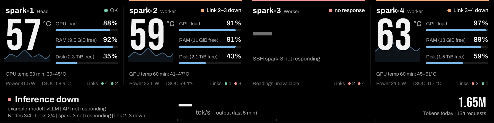
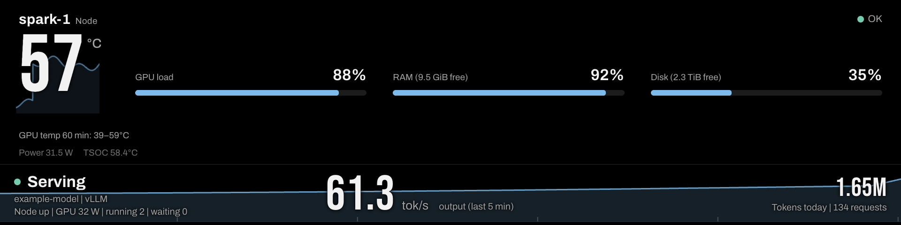

# Rack panel and kiosk

[README](../README.md) · [Topology](topology.md) · [Configuration](configuration.md) · [Web page](dashboard.md) · **Rack panel** · [HTTP API](api.md) · [Development](development.md)

Open `/rack/` (for example <http://127.0.0.1:8787/rack/>). The panel is laid out at 1920 x 480 and scales to fit the window, so it suits the common 1920 x 480 bar displays and works, letterboxed, on anything else.

Each node gets a bay with its GPU temperature (with the last hour drawn behind it), GPU load, memory and disk use, power, TSOC and a coloured dot per link. The bottom band shows the cluster state, the model and engine, node and link counts with the total GPU power, output tok/s over the last five minutes and today's tokens.


<p align="center"><sub>One node not responding and its two links down: the bays name the cause, the band keeps the counts.</sub></p>


<p align="center"><sub>A single node gets one wide bay.</sub></p>

## Updates

The panel polls `/api/state` every 2 seconds without the history and fetches the 60-minute history every 30 seconds for the temperature traces and the band's earlier samples. The band scrolls left in steps of about one pixel rather than gliding, which keeps a Raspberry Pi's CPU low. When the server stops answering, the bays and the band dim and the band stops moving. The page reloads itself every 12 hours, right after a successful health check, so it picks up updates without touching the kiosk.

## Layout by node count

- Three or four nodes share the width. Two nodes get two centred bays. A single node gets one wide bay with its meters side by side and no link dots.
- With two cables between two nodes, each bay shows a numbered dot per cable (`2 #1`, `2 #2`).
- When a bay would be narrower than 460 logical pixels (five or more nodes at 1920, or a narrow `?width`), the bays switch to a compact layout: the name above the status, the temperature above the meters, smaller type, and link dots without peer names. Below about 200 pixels per bay labels are cut short.
- A long node name is cut short with an ellipsis before the status is. Peer names next to the link dots are left out when an id is longer than six characters; give links a short `label` in `topology.json` if their default label (`<id>–<id>`) is long.

## What the bays and the band say

Each bay header shows its most severe condition:

- no response;
- missing GPU readings (`nvidia-smi stuck`, `GPU query timed out`, `GPU query failed`, `no nvidia-smi`);
- thermal slowdown;
- a link problem (`Link 2–3 down`, `Link 1–2 #2 down`, `Link 1–2 not cabled`);
- system state or failed units;
- a missing inference process while the API serves;
- disk at 95% or more, or less than 2 GiB of free memory;
- for ten minutes, a container restart or a kernel error.

The band shows the cluster title (Serving, Ready, Inference stopped, Inference down, Nodes unreachable), the model with its engine, node and link counts and up to two notes.

With [several model servers](topology.md#model-servers) the band's output is the total over the servers and the model line becomes a chip per server: a lamp for its state, its name and its output, or idle or not answering. Each bay names its server, and a bay only misses an inference process while its own server's API serves. `?server=<id>` makes the band follow one server as if it were the only one; the bays keep every node.

## Address options

The kiosk has no keyboard and no settings of its own, so the panel reads its options from its address. The settings dialog on the web page builds this address for you (Rack panel section, Kiosk URL). Options combine, as in `/rack/?width=819&lang=ko&temp=f`.

### Language

`?lang=ko` shows the panel in Korean. The display needs a Korean font: if the text shows as boxes on a Raspberry Pi, install one with `sudo apt install fonts-noto-cjk`.

### Units, colours and motion

- `temp=f` for °F; `mem=gb` for GB and TB.
- `colors=purple,ff8800,...` for node colours on each bay's bars and temperature trace, by position in the topology: palette names (blue, orange, green, ink, purple, gold, magenta, umber, red) or hex without `#`. Without it the panel keeps one data colour.
- `motion=smooth` or `motion=still` for the bottom band, which by default moves in one-pixel steps.

### Other display sizes

Without a parameter the panel is scaled to fit and centred, with even black borders. `?width=N` (800 to 3840) lays it out N pixels wide instead of 1920, still 480 tall, so a display of another aspect ratio is filled edge to edge: use N = 480 x display width / display height (for example `?width=2560` for 2560 x 480 or 1280 x 240, `?width=819` for a 1024 x 600 screen). Below 1440 the bottom band uses smaller type.

## Raspberry Pi kiosk

For Raspberry Pi OS with labwc (Wayland). The `kiosk/` folder has the three pieces. The Pi can run the dashboard itself or only show a dashboard that runs elsewhere.

1. Install the script and make it executable:

   ```bash
   mkdir -p ~/.local/bin ~/.config/autostart ~/.config/labwc
   install -m 755 kiosk/spark-scope-kiosk ~/.local/bin/spark-scope-kiosk
   ```

2. Autostart it with the desktop session: copy `kiosk/spark-scope-kiosk.desktop` to `~/.config/autostart/`, replace `YOUR_USER` with your account name and set the URL. `lwrespawn` (part of Raspberry Pi OS) restarts the kiosk if Chromium exits. The desktop must log in automatically (`sudo raspi-config`, System Options, Boot / Auto Login, Desktop Autologin).

3. Hide the mouse pointer: merge the `<windowRule>` from `kiosk/labwc-rc.xml` into the `<windowRules>` of `~/.config/labwc/rc.xml` (if you have no such file, copy `kiosk/labwc-rc.xml` there) and reload labwc with `kill -HUP $(pgrep -x labwc)`, or log out and in. The page hides the cursor itself, but on Wayland that only takes effect once the pointer enters the window; the labwc rule moves the pointer into the kiosk window and hides it. It matches only the kiosk (the script starts Chromium with `--class=spark-scope-kiosk`), so other Chromium windows keep their pointer. If you used the earlier `identifier="chromium*"` rule, change it to `spark-scope-kiosk`.

4. Set the screen resolution and rotation in Raspberry Pi OS's Screen Configuration. If the panel does not fill the display, add `?width=N` to the URL as described above.

The script waits until `/api/health` answers before it opens Chromium (printing a line once a minute while it waits), uses its own Chromium profile under `~/.local/share/spark-scope-kiosk`, and takes `SPARK_SCOPE_RACK_URL` and `CHROMIUM` from the environment. It turns off the renderer accessibility that Raspberry Pi OS switches on for every Chromium (`--force-renderer-accessibility` in `/etc/chromium.d`): the panel has no screen reader or input, and the accessibility tree is rebuilt on every redraw.

**Showing a dashboard that runs on another machine.** Point `SPARK_SCOPE_RACK_URL` at it, for example `http://dashboard-host:8787/rack/` on the LAN or the machine's Tailscale name or address on a tailnet. The dashboard must then listen beyond localhost (`SPARK_SCOPE_HOST=0.0.0.0` or that interface's address), which exposes it to everyone on that network; see [Security](../README.md#security). To keep the dashboard on localhost instead, forward the port from the Pi with SSH (for example a user service running `ssh -N -L 8787:127.0.0.1:8787 dashboard-host`) and keep the default URL.
